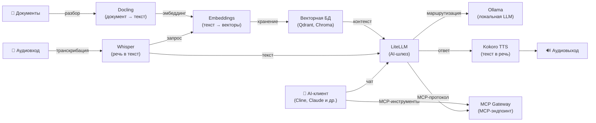

[English](README.md) | [简体中文](README-zh.md) | [繁體中文](README-zh-Hant.md) | [Русский](README-ru.md)

# Docker AI Stack

[](https://docs.docker.com/compose/) &nbsp;[](https://opensource.org/licenses/MIT)

Разверните полный self-hosted AI-стек на собственном сервере одной командой.

- Без настройки: все сервисы автоматически конфигурируются при первом запуске
- Безопасность: Ollama, LiteLLM и MCP Gateway автоматически генерируют API-ключи
- Приватность: аудио, эмбеддинги и LLM-инференс выполняются локально — данные не отправляются третьим лицам
- Опциональная авторизация: Whisper, WhisperLive, Kokoro, Embeddings и Docling работают без API-ключей по умолчанию (задайте ключи через env-файлы для публичных развёртываний)
- [Облегчённые стеки](#облегчённые-стеки) с меньшими требованиями к памяти (от ~2.5 ГБ)
- GPU-ускорение через NVIDIA CUDA

**Примечание:** При использовании LiteLLM с внешними провайдерами (например, OpenAI, Anthropic) ваши данные будут отправляться этим провайдерам.

**Включённые сервисы:**

| Сервис | Назначение | Порт по умолчанию |
|---|---|---|
| **[Ollama (LLM)](https://github.com/hwdsl2/docker-ollama/blob/main/README-ru.md)** | Запуск локальных LLM-моделей (llama3, qwen, mistral и др.) | `11434` |
| **[LiteLLM](https://github.com/hwdsl2/docker-litellm/blob/main/README-ru.md)** | AI-шлюз — маршрутизация запросов к Ollama, OpenAI, Anthropic и 100+ провайдерам | `4000` |
| **[Embeddings](https://github.com/hwdsl2/docker-embeddings/blob/main/README-ru.md)** | Преобразование текста в векторы для семантического поиска и RAG | `8000` |
| **[Whisper (STT)](https://github.com/hwdsl2/docker-whisper/blob/main/README-ru.md)** | Транскрибация речи в текст | `9000` |
| **[WhisperLive (STT в реальном времени)](https://github.com/hwdsl2/docker-whisper-live/blob/main/README-ru.md)** | Транскрибация речи в реальном времени через WebSocket | `9090` |
| **[Kokoro (TTS)](https://github.com/hwdsl2/docker-kokoro/blob/main/README-ru.md)** | Преобразование текста в естественную речь | `8880` |
| **[MCP Gateway](https://github.com/hwdsl2/docker-mcp-gateway/blob/main/README-ru.md)** | Предоставление MCP-инструментов (файловая система, веб, GitHub, поиск, базы данных) AI-клиентам | `3000` |
| **[Docling](https://github.com/hwdsl2/docker-docling/blob/main/README-ru.md)** | Конвертирует документы (PDF, DOCX и др.) в структурированный текст/Markdown | `5001` |

**Также доступно:**

- VPN: [WireGuard](https://github.com/hwdsl2/docker-wireguard), [OpenVPN](https://github.com/hwdsl2/docker-openvpn), [IPsec VPN](https://github.com/hwdsl2/docker-ipsec-vpn-server), [Headscale](https://github.com/hwdsl2/docker-headscale)

## Архитектура



## Быстрый старт

**Требования:**

- Linux-сервер (локальный или облачный) с установленным Docker
- Минимум 8 ГБ оперативной памяти (с небольшими моделями). Для крупных LLM-моделей (8B+) рекомендуется 32 ГБ и более.
- Вы можете закомментировать ненужные сервисы для уменьшения потребления памяти.

**Запуск полного стека:**

```bash
# Клонируйте репозиторий для получения compose-файлов
git clone https://github.com/hwdsl2/docker-ai-stack
cd docker-ai-stack
docker compose up -d
```

**Загрузка модели** (обязательно перед отправкой LLM-запросов):

```bash
docker exec ollama ollama_manage --pull llama3.2:3b
```

Проверьте логи для подтверждения готовности всех сервисов:

```bash
docker compose logs
```

Запустите проверку работоспособности, чтобы убедиться, что все сервисы работают:

```bash
./stack-check.sh
```

**Получение API-ключей:**

```bash
# API-ключ Ollama
docker exec ollama ollama_manage --showkey

# API-ключ LiteLLM
docker exec litellm litellm_manage --showkey

# API-ключ MCP Gateway
docker exec mcp mcp_manage --showkey
```

**Доступ к панели администратора LiteLLM:**

Откройте `http://<server-ip>:4000/ui` в браузере. Войдите с именем пользователя `admin` и вашим мастер-ключом LiteLLM в качестве пароля. Панель администратора предоставляет управление виртуальными ключами, отслеживание расходов и настройку моделей.

**Остановка стека:**

```bash
docker compose down
```

## GPU-ускорение (NVIDIA CUDA)

Для GPU-ускорения NVIDIA используйте CUDA compose-файл:

```bash
docker compose -f docker-compose.cuda.yml up -d
```

**Требования:** GPU NVIDIA, [драйвер NVIDIA](https://www.nvidia.com/en-us/drivers/) 535+, и [NVIDIA Container Toolkit](https://docs.nvidia.com/datacenter/cloud-native/container-toolkit/latest/install-guide.html), установленный на хосте. CUDA-образы поддерживают только `linux/amd64`.

## Облегчённые стеки

Не нужен полный стек? Используйте преднастроенное подмножество из папки `stacks/`:

| Стек | Сервисы | Память | Сценарий использования |
|---|---|---|---|
| **[chat-ui](stacks/chat-ui/README-ru.md)** | Ollama + LiteLLM + AnythingLLM | ~3 ГБ | Веб-интерфейс для чата в стиле ChatGPT |
| **[voice-pipeline](stacks/voice-pipeline/README-ru.md)** | Whisper + Ollama + LiteLLM + Kokoro | ~5 ГБ | Речь в текст → LLM → текст в речь |
| **[rag-pipeline](stacks/rag-pipeline/README-ru.md)** | Ollama + LiteLLM + Embeddings | ~3 ГБ | Семантический поиск + LLM Q&A |
| **[rag-pipeline-full](stacks/rag-pipeline-full/README-ru.md)** | Ollama + LiteLLM + Embeddings + Docling | ~4 ГБ | Разбор документов + семантический поиск + LLM Q&A |
| **[ai-tools](stacks/ai-tools/README-ru.md)** | Ollama + LiteLLM + MCP Gateway | ~3 ГБ | AI-ассистент для разработки с доступом к инструментам |
| **[chat-only](stacks/chat-only/README-ru.md)** | Ollama + LiteLLM | ~2.5 ГБ | Минимальная локальная замена ChatGPT |

```bash
git clone https://github.com/hwdsl2/docker-ai-stack
cd docker-ai-stack/stacks/chat-ui  # или voice-pipeline, rag-pipeline, rag-pipeline-full, ai-tools, chat-only
docker compose up -d
```

## Запуск без Docker Compose

Если вы предпочитаете использовать команды `docker run` напрямую, сначала создайте общую сеть для связи между сервисами:

```bash
docker network create ai-stack
```

Затем запустите каждый сервис в общей сети:

```bash
# Ollama (LLM)
docker run -d --name ollama --restart always \
    --network ai-stack \
    -v ollama-data:/var/lib/ollama \
    hwdsl2/ollama-server

# LiteLLM (AI-шлюз)
docker run -d --name litellm --restart always \
    --network ai-stack \
    -p 4000:4000 \
    -e LITELLM_OLLAMA_BASE_URL=http://ollama:11434 \
    -v litellm-data:/etc/litellm \
    hwdsl2/litellm-server

# Embeddings
docker run -d --name embeddings --restart always \
    --network ai-stack \
    -p 127.0.0.1:8000:8000 \
    -v embeddings-data:/var/lib/embeddings \
    hwdsl2/embeddings-server

# Whisper (STT)
docker run -d --name whisper --restart always \
    --network ai-stack \
    -p 127.0.0.1:9000:9000 \
    -v whisper-data:/var/lib/whisper \
    hwdsl2/whisper-server

# Kokoro (TTS)
docker run -d --name kokoro --restart always \
    --network ai-stack \
    -p 127.0.0.1:8880:8880 \
    -v kokoro-data:/var/lib/kokoro \
    hwdsl2/kokoro-server

# Docling (разбор документов)
docker run -d --name docling --restart always \
    --network ai-stack \
    -p 127.0.0.1:5001:5001 \
    -v docling-data:/var/lib/docling \
    hwdsl2/docling-server

# MCP Gateway
docker run -d --name mcp --restart always \
    --network ai-stack \
    -v mcp-data:/var/lib/mcp \
    hwdsl2/mcp-gateway
```

**Примечание:** Общая сеть позволяет сервисам обращаться друг к другу по имени контейнера (например, LiteLLM подключается к Ollama через `http://ollama:11434`). Вы можете запускать только нужные сервисы — не обязательно запускать все.

**Загрузка модели** (обязательно перед отправкой LLM-запросов):

```bash
docker exec ollama ollama_manage --pull llama3.2:3b
```

## Подключение MCP Gateway к LiteLLM

В compose-файлах этого репозитория LiteLLM и MCP Gateway **подключаются автоматически** — ручная настройка ключей не требуется.

API-ключи автоматически передаются между сервисами через общие Docker-тома:

- Ollama генерирует API-ключ при первом запуске и копирует его в общий том
- MCP Gateway делает то же самое
- LiteLLM считывает оба ключа из общих томов при запуске

Переменные `LITELLM_MCP_URL=http://mcp:3000/mcp` и `LITELLM_OLLAMA_BASE_URL=http://ollama:11434` уже заданы в compose-файлах, поэтому все сервисы подключаются автоматически одной командой `docker compose up -d`.

После подключения AI-клиенты, обращающиеся к LiteLLM, смогут использовать MCP-инструменты (файловая система, web-fetch, GitHub и др.) напрямую через прокси LiteLLM.

## Пример голосового конвейера

Транскрибируйте голосовой вопрос, получите ответ от локальной LLM через Ollama и преобразуйте его в речь:

**Совет:** Нужен образец аудиофайла? Скачайте этот образец английской речи (WAV, лицензия MIT) из репозитория [Azure Samples](https://github.com/Azure-Samples/cognitive-services-speech-sdk):

```bash
curl -L -o sample_speech.wav \
    "https://github.com/Azure-Samples/cognitive-services-speech-sdk/raw/master/sampledata/audiofiles/katiesteve.wav"
```

```bash
LITELLM_KEY=$(docker exec litellm litellm_manage --getkey)

# Шаг 1: Транскрибация аудио в текст (Whisper)
TEXT=$(curl -s http://localhost:9000/v1/audio/transcriptions \
    -F file=@sample_speech.wav -F model=whisper-1 | jq -r .text)

# Шаг 2: Отправка текста в Ollama через LiteLLM и получение ответа
RESPONSE=$(curl -s http://localhost:4000/v1/chat/completions \
    -H "Authorization: Bearer $LITELLM_KEY" \
    -H "Content-Type: application/json" \
    -d "{\"model\":\"ollama/llama3.2:3b\",\"messages\":[{\"role\":\"user\",\"content\":\"$TEXT\"}]}" \
    | jq -r '.choices[0].message.content')

# Шаг 3: Преобразование ответа в речь (Kokoro TTS)
curl -s http://localhost:8880/v1/audio/speech \
    -H "Content-Type: application/json" \
    -d "{\"model\":\"tts-1\",\"input\":\"$RESPONSE\",\"voice\":\"af_heart\"}" \
    --output response.mp3
```

## Пример RAG-конвейера

Создание эмбеддингов документов для семантического поиска, извлечение контекста и ответы на вопросы с помощью локальной модели Ollama:

```bash
LITELLM_KEY=$(docker exec litellm litellm_manage --getkey)

# Шаг 1: Создание эмбеддинга фрагмента документа и сохранение вектора в векторной БД
curl -s http://localhost:8000/v1/embeddings \
    -H "Content-Type: application/json" \
    -d '{"input": "Docker simplifies deployment by packaging apps in containers.", "model": "text-embedding-ada-002"}' \
    | jq '.data[0].embedding'
# → Сохраните возвращённый вектор вместе с исходным текстом в Qdrant, Chroma, pgvector и т.д.

# Шаг 2: При запросе создайте эмбеддинг вопроса, извлеките наиболее релевантные фрагменты
#          из векторной БД, затем отправьте вопрос и контекст в Ollama через LiteLLM.
curl -s http://localhost:4000/v1/chat/completions \
    -H "Authorization: Bearer $LITELLM_KEY" \
    -H "Content-Type: application/json" \
    -d '{
      "model": "ollama/llama3.2:3b",
      "messages": [
        {"role": "system", "content": "Answer using only the provided context."},
        {"role": "user", "content": "What does Docker do?\n\nContext: Docker simplifies deployment by packaging apps in containers."}
      ]
    }' \
    | jq -r '.choices[0].message.content'
```

## Пример MCP-инструментов

Используйте MCP Gateway для предоставления AI-ассистенту доступа к файлам, вебу и GitHub:

```bash
MCP_KEY=$(docker exec mcp mcp_manage --showkey | grep '^mcp-' | head -1)

# Используйте MCP-эндпоинт с AI-клиентом (например, Cline в VS Code)
# URL MCP-сервера: http://localhost:3000/mcp
# Заголовок Authorization: Bearer <api_key>

# Или протестируйте MCP-эндпоинт напрямую
curl -s http://localhost:3000/mcp \
    -X POST \
    -H "Authorization: Bearer $MCP_KEY" \
    -H "Content-Type: application/json" \
    -H "Accept: application/json, text/event-stream" \
    -d '{"jsonrpc":"2.0","id":1,"method":"initialize","params":{"protocolVersion":"2025-03-26","capabilities":{},"clientInfo":{"name":"test","version":"1.0"}}}'
```

## Настройка

Каждый сервис можно настроить с помощью опционального env-файла. Скопируйте пример env-файла из соответствующего репозитория, отредактируйте его и раскомментируйте монтирование тома в `docker-compose.yml`:

| Сервис | Env-файл | Репозиторий |
|---|---|---|
| Ollama | `ollama.env` | [docker-ollama](https://github.com/hwdsl2/docker-ollama/blob/main/README-ru.md) |
| LiteLLM | `litellm.env` | [docker-litellm](https://github.com/hwdsl2/docker-litellm/blob/main/README-ru.md) |
| Embeddings | `embed.env` | [docker-embeddings](https://github.com/hwdsl2/docker-embeddings/blob/main/README-ru.md) |
| Whisper | `whisper.env` | [docker-whisper](https://github.com/hwdsl2/docker-whisper/blob/main/README-ru.md) |
| WhisperLive | `whisper-live.env` | [docker-whisper-live](https://github.com/hwdsl2/docker-whisper-live/blob/main/README-ru.md) |
| Kokoro | `kokoro.env` | [docker-kokoro](https://github.com/hwdsl2/docker-kokoro/blob/main/README-ru.md) |
| MCP Gateway | `mcp.env` | [docker-mcp-gateway](https://github.com/hwdsl2/docker-mcp-gateway/blob/main/README-ru.md) |
| Docling | `docling.env` | [docker-docling](https://github.com/hwdsl2/docker-docling/blob/main/README-ru.md) |

Подробные параметры настройки, справочник API и управление моделями описаны в документации каждого сервиса.

## Развёртывание с доступом из интернета

По умолчанию все сервисы слушают по незашифрованному HTTP. Для развёртываний с доступом из интернета установите обратный прокси (например, [Caddy](https://caddyserver.com/), Nginx или Traefik) перед стеком для обеспечения HTTPS. Каждый репозиторий сервиса содержит подробное [руководство по обратному прокси](https://github.com/hwdsl2/docker-whisper/blob/main/README-ru.md#использование-обратного-прокси) с примерами для Caddy и nginx. Стек [chat-ui](stacks/chat-ui/README-ru.md) также содержит раздел по обратному прокси для AnythingLLM.

При открытии сервисов в интернет установите API-ключи для сервисов с опциональной авторизацией (Whisper, WhisperLive, Kokoro, Embeddings, Docling) через соответствующие env-файлы.

## Резервное копирование и восстановление

Ваши API-ключи, модели и конфигурация хранятся в Docker-томах. Создайте резервную копию перед обновлением или внесением изменений:

```bash
# Экспорт API-ключей (при работающих контейнерах)
docker exec ollama ollama_manage --showkey
docker exec litellm litellm_manage --showkey
docker exec mcp mcp_manage --showkey

# Резервное копирование всех томов (сначала остановите сервисы)
docker compose down
mkdir -p backups
for vol in ollama-data litellm-data litellm-db embeddings-data whisper-data whisper-live-data kokoro-data mcp-data docling-data anythingllm-data; do
  docker volume inspect "$vol" >/dev/null 2>&1 && \
    docker run --rm -v "${vol}:/source:ro" -v "$(pwd)/backups:/backup" \
      alpine tar czf "/backup/${vol}.tar.gz" -C /source .
done
```

**Примечание:** Тома `ollama-shared`, `mcp-shared` и `litellm-shared` являются временными томами для передачи ключей и не требуют резервного копирования.

Инструкции по восстановлению, миграции на новый сервер и полный контрольный список перед обновлением см. в руководстве [Резервное копирование и восстановление](docs/backup-restore-ru.md).

## Обновление образов

Обновление всех сервисов до последних версий:

```bash
docker compose pull
docker compose up -d
./stack-check.sh
```

Ваши данные сохраняются в Docker-томах. **Всегда [создавайте резервную копию](#резервное-копирование-и-восстановление) перед обновлением.**

## Лицензия

Copyright (C) 2026 Lin Song   
Данный проект лицензирован на условиях [лицензии MIT](https://opensource.org/licenses/MIT).

Данный проект представляет собой независимую Docker-конфигурацию и не аффилирован с Ollama, Berri AI (LiteLLM), Hugging Face, hexgrad (Kokoro), OpenAI, SYSTRAN или MCPHub, не одобрен и не спонсирован ими.
