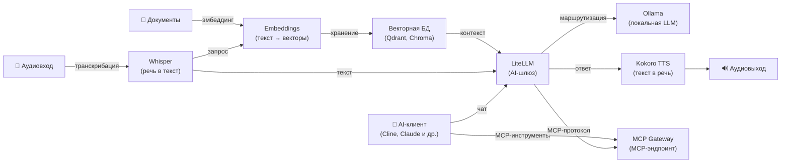

[English](README.md) | [简体中文](README-zh.md) | [繁體中文](README-zh-Hant.md) | [Русский](README-ru.md)

# Docker AI Stack

[](https://opensource.org/licenses/MIT)

Разверните полный self-hosted AI-стек на собственном сервере одной командой. Все сервисы автоматически настраиваются с безопасными значениями по умолчанию при первом запуске. Обработка аудио (Whisper, Kokoro), эмбеддинги и LLM-инференс (Ollama) выполняются локально. При использовании LiteLLM с внешними провайдерами (например, OpenAI, Anthropic) ваши данные будут отправляться этим провайдерам.

**Включённые сервисы:**

| Сервис | Назначение | Порт по умолчанию |
|---|---|---|
| **[Ollama (LLM)](https://github.com/hwdsl2/docker-ollama)** | Запуск локальных LLM-моделей (llama3, qwen, mistral и др.) | `11434` |
| **[LiteLLM](https://github.com/hwdsl2/docker-litellm)** | AI-шлюз — маршрутизация запросов к Ollama, OpenAI, Anthropic и 100+ провайдерам | `4000` |
| **[Embeddings](https://github.com/hwdsl2/docker-embeddings)** | Преобразование текста в векторы для семантического поиска и RAG | `8000` |
| **[Whisper (STT)](https://github.com/hwdsl2/docker-whisper)** | Транскрибация речи в текст | `9000` |
| **[Kokoro (TTS)](https://github.com/hwdsl2/docker-kokoro)** | Преобразование текста в естественную речь | `8880` |
| **[MCP Gateway](https://github.com/hwdsl2/docker-mcp-gateway)** | Предоставление MCP-инструментов (файловая система, веб, GitHub, поиск, базы данных) AI-клиентам | `3000` |

**Также доступно:**

- AI/Аудио: [WhisperLive (STT в реальном времени)](https://github.com/hwdsl2/docker-whisper-live)
- VPN: [WireGuard](https://github.com/hwdsl2/docker-wireguard), [OpenVPN](https://github.com/hwdsl2/docker-openvpn), [IPsec VPN](https://github.com/hwdsl2/docker-ipsec-vpn-server), [Headscale](https://github.com/hwdsl2/docker-headscale)

## Архитектура



## Быстрый старт

**Требования:**

- Linux-сервер (локальный или облачный) с установленным Docker
- Минимум 8 ГБ оперативной памяти (с небольшими моделями). Для крупных LLM-моделей (8B+) рекомендуется 32 ГБ и более.
- Вы можете закомментировать ненужные сервисы для уменьшения потребления памяти.

**Запуск полного стека:**

```bash
# Клонируйте репозиторий для получения compose-файлов
git clone https://github.com/hwdsl2/docker-ai-stack
cd docker-ai-stack
docker compose up -d
```

Проверьте логи для подтверждения готовности всех сервисов:

```bash
docker compose logs
```

**Получение API-ключей:**

```bash
# API-ключ Ollama
docker exec ollama ollama_manage --showkey

# API-ключ LiteLLM
docker exec litellm litellm_manage --getkey

# API-ключ MCP Gateway
docker exec mcp mcp_manage --getkey
```

**Остановка стека:**

```bash
docker compose down
```

## GPU-ускорение (NVIDIA CUDA)

Для GPU-ускорения NVIDIA используйте CUDA compose-файл:

```bash
docker compose -f docker-compose.cuda.yml up -d
```

**Требования:** GPU NVIDIA, [драйвер NVIDIA](https://www.nvidia.com/en-us/drivers/) 535+, и [NVIDIA Container Toolkit](https://docs.nvidia.com/datacenter/cloud-native/container-toolkit/latest/install-guide.html), установленный на хосте. CUDA-образы поддерживают только `linux/amd64`.

## Подключение MCP Gateway к LiteLLM

```yaml
# В конфигурации LiteLLM добавьте MCP-шлюз как источник инструментов:
mcp_servers:
  - url: http://mcp:3000/mcp
    transport: sse
    headers:
      Authorization: "Bearer <mcp_api_key>"
```

## Пример голосового конвейера

Транскрибируйте голосовой вопрос, получите ответ от локальной LLM через Ollama и преобразуйте его в речь:

```bash
LITELLM_KEY=$(docker exec litellm litellm_manage --getkey)

# Шаг 1: Транскрибация аудио в текст (Whisper)
TEXT=$(curl -s http://localhost:9000/v1/audio/transcriptions \
    -F file=@question.mp3 -F model=whisper-1 | jq -r .text)

# Шаг 2: Отправка текста в Ollama через LiteLLM и получение ответа
RESPONSE=$(curl -s http://localhost:4000/v1/chat/completions \
    -H "Authorization: Bearer $LITELLM_KEY" \
    -H "Content-Type: application/json" \
    -d "{\"model\":\"ollama/llama3.2:3b\",\"messages\":[{\"role\":\"user\",\"content\":\"$TEXT\"}]}" \
    | jq -r '.choices[0].message.content')

# Шаг 3: Преобразование ответа в речь (Kokoro TTS)
curl -s http://localhost:8880/v1/audio/speech \
    -H "Content-Type: application/json" \
    -d "{\"model\":\"tts-1\",\"input\":\"$RESPONSE\",\"voice\":\"af_heart\"}" \
    --output response.mp3
```

## Пример RAG-конвейера

Создание эмбеддингов документов для семантического поиска, извлечение контекста и ответы на вопросы с помощью локальной модели Ollama:

```bash
LITELLM_KEY=$(docker exec litellm litellm_manage --getkey)

# Шаг 1: Создание эмбеддинга фрагмента документа и сохранение вектора в векторной БД
curl -s http://localhost:8000/v1/embeddings \
    -H "Content-Type: application/json" \
    -d '{"input": "Docker simplifies deployment by packaging apps in containers.", "model": "text-embedding-ada-002"}' \
    | jq '.data[0].embedding'
# → Сохраните возвращённый вектор вместе с исходным текстом в Qdrant, Chroma, pgvector и т.д.

# Шаг 2: При запросе создайте эмбеддинг вопроса, извлеките наиболее релевантные фрагменты
#          из векторной БД, затем отправьте вопрос и контекст в Ollama через LiteLLM.
curl -s http://localhost:4000/v1/chat/completions \
    -H "Authorization: Bearer $LITELLM_KEY" \
    -H "Content-Type: application/json" \
    -d '{
      "model": "ollama/llama3.2:3b",
      "messages": [
        {"role": "system", "content": "Answer using only the provided context."},
        {"role": "user", "content": "What does Docker do?\n\nContext: Docker simplifies deployment by packaging apps in containers."}
      ]
    }' \
    | jq -r '.choices[0].message.content'
```

## Пример MCP-инструментов

Используйте MCP Gateway для предоставления AI-ассистенту доступа к файлам, вебу и GitHub:

```bash
MCP_KEY=$(docker exec mcp mcp_manage --getkey)

# Используйте MCP-эндпоинт с AI-клиентом (например, Cline в VS Code)
# URL MCP-сервера: http://localhost:3000/mcp
# Заголовок Authorization: Bearer <api_key>

# Или протестируйте MCP-эндпоинт напрямую
curl -s http://localhost:3000/mcp \
    -X POST \
    -H "Authorization: Bearer $MCP_KEY" \
    -H "Content-Type: application/json" \
    -H "Accept: application/json, text/event-stream" \
    -d '{"jsonrpc":"2.0","id":1,"method":"initialize","params":{"protocolVersion":"2025-03-26","capabilities":{},"clientInfo":{"name":"test","version":"1.0"}}}'
```

## Настройка

Каждый сервис можно настроить с помощью опционального env-файла. Скопируйте пример env-файла из соответствующего репозитория, отредактируйте его и раскомментируйте монтирование тома в `docker-compose.yml`:

| Сервис | Env-файл | Репозиторий |
|---|---|---|
| Ollama | `ollama.env` | [docker-ollama](https://github.com/hwdsl2/docker-ollama) |
| LiteLLM | `litellm.env` | [docker-litellm](https://github.com/hwdsl2/docker-litellm) |
| Embeddings | `embed.env` | [docker-embeddings](https://github.com/hwdsl2/docker-embeddings) |
| Whisper | `whisper.env` | [docker-whisper](https://github.com/hwdsl2/docker-whisper) |
| Kokoro | `kokoro.env` | [docker-kokoro](https://github.com/hwdsl2/docker-kokoro) |
| MCP Gateway | `mcp.env` | [docker-mcp-gateway](https://github.com/hwdsl2/docker-mcp-gateway) |

Подробные параметры настройки, справочник API и управление моделями описаны в документации каждого сервиса.

## Обновление образов

Обновление всех сервисов до последних версий:

```bash
docker compose pull
docker compose up -d
```

Ваши данные сохраняются в Docker-томах.

## Лицензия

Copyright (C) 2026 Lin Song   
Данный проект лицензирован на условиях [лицензии MIT](https://opensource.org/licenses/MIT).

Данный проект представляет собой независимую Docker-конфигурацию и не аффилирован с Ollama, Berri AI (LiteLLM), Hugging Face, hexgrad (Kokoro), OpenAI, SYSTRAN или MCPHub, не одобрен и не спонсирован ими.
