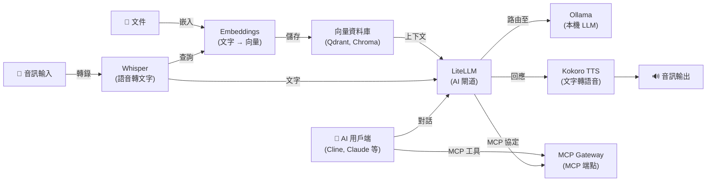

[English](README.md) | [简体中文](README-zh.md) | [繁體中文](README-zh-Hant.md) | [Русский](README-ru.md)

# Docker AI Stack

[](https://opensource.org/licenses/MIT)

一鍵在您自己的伺服器上部署完整的自託管 AI 技術堆疊。所有服務在首次啟動時自動配置安全預設值。音訊處理（Whisper、Kokoro）、向量嵌入和大型語言模型推理（Ollama）均在本機執行。當使用 LiteLLM 連接外部提供商（如 OpenAI、Anthropic）時，您的資料將發送給這些提供商。

**包含的服務：**

| 服務 | 用途 | 預設連接埠 |
|---|---|---|
| **[Ollama (LLM)](https://github.com/hwdsl2/docker-ollama)** | 執行本機大型語言模型（llama3、qwen、mistral 等） | `11434` |
| **[LiteLLM](https://github.com/hwdsl2/docker-litellm)** | AI 閘道 — 將請求路由至 Ollama、OpenAI、Anthropic 及 100+ 提供商 | `4000` |
| **[Embeddings](https://github.com/hwdsl2/docker-embeddings)** | 將文字轉換為向量，用於語意搜尋和 RAG | `8000` |
| **[Whisper (STT)](https://github.com/hwdsl2/docker-whisper)** | 將語音轉錄為文字 | `9000` |
| **[Kokoro (TTS)](https://github.com/hwdsl2/docker-kokoro)** | 將文字轉換為自然語音 | `8880` |
| **[MCP Gateway](https://github.com/hwdsl2/docker-mcp-gateway)** | 為 AI 用戶端提供 MCP 工具（檔案系統、網頁擷取、GitHub、搜尋、資料庫） | `3000` |

**另提供：**

- AI/音訊：[WhisperLive（即時語音轉文字）](https://github.com/hwdsl2/docker-whisper-live)
- VPN：[WireGuard](https://github.com/hwdsl2/docker-wireguard)、[OpenVPN](https://github.com/hwdsl2/docker-openvpn)、[IPsec VPN](https://github.com/hwdsl2/docker-ipsec-vpn-server)、[Headscale](https://github.com/hwdsl2/docker-headscale)

## 架構



## 快速開始

**系統需求：**

- 一台安裝了 Docker 的 Linux 伺服器（本機或雲端）
- 至少 8 GB 記憶體（使用小型模型）。對於較大的 LLM 模型（8B+），建議 32 GB 或以上。
- 您可以註解掉不需要的服務以減少記憶體使用。

**啟動完整技術堆疊：**

```bash
# 複製儲存庫以取得編排檔案
git clone https://github.com/hwdsl2/docker-ai-stack
cd docker-ai-stack
docker compose up -d
```

檢視日誌確認所有服務已就緒：

```bash
docker compose logs
```

**取得 API 金鑰：**

```bash
# Ollama API 金鑰
docker exec ollama ollama_manage --showkey

# LiteLLM API 金鑰
docker exec litellm litellm_manage --getkey

# MCP Gateway API 金鑰
docker exec mcp mcp_manage --getkey
```

**停止技術堆疊：**

```bash
docker compose down
```

## GPU 加速 (NVIDIA CUDA)

如需 NVIDIA GPU 加速，請使用 CUDA 編排檔案：

```bash
docker compose -f docker-compose.cuda.yml up -d
```

**需求：** NVIDIA GPU、[NVIDIA 驅動程式](https://www.nvidia.com/en-us/drivers/) 535+，以及在主機上安裝 [NVIDIA Container Toolkit](https://docs.nvidia.com/datacenter/cloud-native/container-toolkit/latest/install-guide.html)。CUDA 映像檔僅支援 `linux/amd64`。

## 將 MCP Gateway 連接到 LiteLLM

```yaml
# 在 LiteLLM 設定中，新增 MCP 閘道作為工具來源：
mcp_servers:
  - url: http://mcp:3000/mcp
    transport: sse
    headers:
      Authorization: "Bearer <mcp_api_key>"
```

## 語音管道範例

轉錄語音問題，透過 Ollama 取得本機 LLM 回應，然後轉換為語音：

```bash
LITELLM_KEY=$(docker exec litellm litellm_manage --getkey)

# 第 1 步：將音訊轉錄為文字（Whisper）
TEXT=$(curl -s http://localhost:9000/v1/audio/transcriptions \
    -F file=@question.mp3 -F model=whisper-1 | jq -r .text)

# 第 2 步：透過 LiteLLM 將文字傳送至 Ollama 並取得回應
RESPONSE=$(curl -s http://localhost:4000/v1/chat/completions \
    -H "Authorization: Bearer $LITELLM_KEY" \
    -H "Content-Type: application/json" \
    -d "{\"model\":\"ollama/llama3.2:3b\",\"messages\":[{\"role\":\"user\",\"content\":\"$TEXT\"}]}" \
    | jq -r '.choices[0].message.content')

# 第 3 步：將回應轉換為語音（Kokoro TTS）
curl -s http://localhost:8880/v1/audio/speech \
    -H "Content-Type: application/json" \
    -d "{\"model\":\"tts-1\",\"input\":\"$RESPONSE\",\"voice\":\"af_heart\"}" \
    --output response.mp3
```

## RAG 管道範例

嵌入文件用於語意搜尋，擷取上下文，然後使用本機 Ollama 模型回答問題：

```bash
LITELLM_KEY=$(docker exec litellm litellm_manage --getkey)

# 第 1 步：嵌入文件片段並將向量儲存到向量資料庫
curl -s http://localhost:8000/v1/embeddings \
    -H "Content-Type: application/json" \
    -d '{"input": "Docker simplifies deployment by packaging apps in containers.", "model": "text-embedding-ada-002"}' \
    | jq '.data[0].embedding'
# → 將傳回的向量與來源文字一起儲存到 Qdrant、Chroma、pgvector 等。

# 第 2 步：查詢時，嵌入問題，從向量資料庫中擷取最符合的片段，
#          然後透過 LiteLLM 將問題和擷取到的上下文傳送至 Ollama。
curl -s http://localhost:4000/v1/chat/completions \
    -H "Authorization: Bearer $LITELLM_KEY" \
    -H "Content-Type: application/json" \
    -d '{
      "model": "ollama/llama3.2:3b",
      "messages": [
        {"role": "system", "content": "Answer using only the provided context."},
        {"role": "user", "content": "What does Docker do?\n\nContext: Docker simplifies deployment by packaging apps in containers."}
      ]
    }' \
    | jq -r '.choices[0].message.content'
```

## MCP 工具範例

使用 MCP Gateway 為您的 AI 助手提供檔案、網路和 GitHub 存取：

```bash
MCP_KEY=$(docker exec mcp mcp_manage --getkey)

# 在 AI 用戶端中使用 MCP 端點（例如 VS Code 中的 Cline）
# 設定 MCP 伺服器 URL：http://localhost:3000/mcp
# 設定 Authorization 標頭：Bearer <api_key>

# 或直接測試 MCP 端點
curl -s http://localhost:3000/mcp \
    -X POST \
    -H "Authorization: Bearer $MCP_KEY" \
    -H "Content-Type: application/json" \
    -H "Accept: application/json, text/event-stream" \
    -d '{"jsonrpc":"2.0","id":1,"method":"initialize","params":{"protocolVersion":"2025-03-26","capabilities":{},"clientInfo":{"name":"test","version":"1.0"}}}'
```

## 自訂設定

每個服務可以透過可選的 env 檔案進行設定。從相應儲存庫複製範例 env 檔案，編輯後取消 `docker-compose.yml` 中的磁碟區掛載註解：

| 服務 | Env 檔案 | 儲存庫 |
|---|---|---|
| Ollama | `ollama.env` | [docker-ollama](https://github.com/hwdsl2/docker-ollama) |
| LiteLLM | `litellm.env` | [docker-litellm](https://github.com/hwdsl2/docker-litellm) |
| Embeddings | `embed.env` | [docker-embeddings](https://github.com/hwdsl2/docker-embeddings) |
| Whisper | `whisper.env` | [docker-whisper](https://github.com/hwdsl2/docker-whisper) |
| Kokoro | `kokoro.env` | [docker-kokoro](https://github.com/hwdsl2/docker-kokoro) |
| MCP Gateway | `mcp.env` | [docker-mcp-gateway](https://github.com/hwdsl2/docker-mcp-gateway) |

有關詳細設定選項、API 參考和模型管理，請參閱各服務儲存庫的文件。

## 更新映像檔

將所有服務更新到最新版本：

```bash
docker compose pull
docker compose up -d
```

您的資料保存在 Docker 磁碟區中。

## 授權協議

Copyright (C) 2026 Lin Song   
本專案以 [MIT 授權條款](https://opensource.org/licenses/MIT) 授權。

本專案是獨立的 Docker 設定，與 Ollama、Berri AI（LiteLLM）、Hugging Face、hexgrad（Kokoro）、OpenAI、SYSTRAN 或 MCPHub 無關聯，未獲其背書或贊助。
