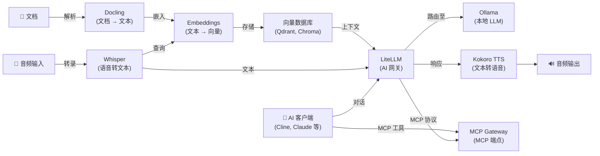

[English](README.md) | [简体中文](README-zh.md) | [繁體中文](README-zh-Hant.md) | [Русский](README-ru.md)

# Docker AI Stack

[](https://docs.docker.com/compose/) &nbsp;[](https://opensource.org/licenses/MIT)

一键在您自己的服务器上部署完整的自托管 AI 技术栈。

- 零配置：所有服务在首次启动时自动配置
- 安全：Ollama、LiteLLM 和 MCP Gateway 自动生成 API 密钥
- 隐私：音频、向量嵌入和大语言模型推理均在本地运行 — 无数据发送给第三方
- 可选认证：Whisper、WhisperLive、Kokoro、Embeddings 和 Docling 默认无需 API 密钥（面向公网部署时可通过 env 文件设置密钥）
- 提供[轻量级技术栈](#轻量级技术栈)，降低内存要求（最低约 2.5 GB）
- 支持 NVIDIA CUDA GPU 加速

**注：** 当使用 LiteLLM 连接外部提供商（如 OpenAI、Anthropic）时，您的数据将发送给这些提供商。

**包含的服务：**

| 服务 | 用途 | 默认端口 |
|---|---|---|
| **[Ollama (LLM)](https://github.com/hwdsl2/docker-ollama/blob/main/README-zh.md)** | 运行本地大语言模型（llama3、qwen、mistral 等） | `11434` |
| **[LiteLLM](https://github.com/hwdsl2/docker-litellm/blob/main/README-zh.md)** | AI 网关 — 将请求路由至 Ollama、OpenAI、Anthropic 及 100+ 提供商 | `4000` |
| **[Embeddings](https://github.com/hwdsl2/docker-embeddings/blob/main/README-zh.md)** | 将文本转换为向量，用于语义搜索和 RAG | `8000` |
| **[Whisper (STT)](https://github.com/hwdsl2/docker-whisper/blob/main/README-zh.md)** | 将语音转录为文本 | `9000` |
| **[WhisperLive（实时语音转文本）](https://github.com/hwdsl2/docker-whisper-live/blob/main/README-zh.md)** | 通过 WebSocket 实时语音转文本 | `9090` |
| **[Kokoro (TTS)](https://github.com/hwdsl2/docker-kokoro/blob/main/README-zh.md)** | 将文本转换为自然语音 | `8880` |
| **[MCP Gateway](https://github.com/hwdsl2/docker-mcp-gateway/blob/main/README-zh.md)** | 为 AI 客户端提供 MCP 工具（文件系统、网页抓取、GitHub、搜索、数据库） | `3000` |
| **[Docling](https://github.com/hwdsl2/docker-docling/blob/main/README-zh.md)** | 将文档（PDF、DOCX 等）转换为结构化文本/Markdown | `5001` |

**另提供：**

- VPN：[WireGuard](https://github.com/hwdsl2/docker-wireguard)、[OpenVPN](https://github.com/hwdsl2/docker-openvpn)、[IPsec VPN](https://github.com/hwdsl2/docker-ipsec-vpn-server)、[Headscale](https://github.com/hwdsl2/docker-headscale)

## 架构



## 快速开始

**系统要求：**

- 一台安装了 Docker 的 Linux 服务器（本地或云端）
- 至少 8 GB 内存（使用小型模型）。对于较大的 LLM 模型（8B+），建议 32 GB 或以上。
- 您可以注释掉不需要的服务以减少内存使用。

**启动完整技术栈：**

```bash
# 克隆仓库以获取编排文件
git clone https://github.com/hwdsl2/docker-ai-stack
cd docker-ai-stack
docker compose up -d
```

**拉取模型**（发出 LLM 请求前必须执行）：

```bash
docker exec ollama ollama_manage --pull llama3.2:3b
```

查看日志确认所有服务已就绪：

```bash
docker compose logs
```

运行健康检查以验证所有服务正常工作：

```bash
./stack-check.sh
```

**获取 API 密钥：**

```bash
# Ollama API 密钥
docker exec ollama ollama_manage --showkey

# LiteLLM API 密钥
docker exec litellm litellm_manage --showkey

# MCP Gateway API 密钥
docker exec mcp mcp_manage --showkey
```

**访问 LiteLLM 管理界面：**

在浏览器中打开 `http://<server-ip>:4000/ui`。使用用户名 `admin` 和您的 LiteLLM 主密钥作为密码登录。管理界面提供虚拟密钥管理、支出追踪和模型配置功能。

**停止技术栈：**

```bash
docker compose down
```

## GPU 加速 (NVIDIA CUDA)

如需 NVIDIA GPU 加速，请使用 CUDA 编排文件：

```bash
docker compose -f docker-compose.cuda.yml up -d
```

**要求：** NVIDIA GPU、[NVIDIA 驱动](https://www.nvidia.com/en-us/drivers/) 535+，以及在宿主机上安装 [NVIDIA Container Toolkit](https://docs.nvidia.com/datacenter/cloud-native/container-toolkit/latest/install-guide.html)。CUDA 镜像仅支持 `linux/amd64`。

## 轻量级技术栈

不需要完整技术栈？使用 `stacks/` 文件夹中的预配置子集：

| 技术栈 | 服务 | 内存 | 使用场景 |
|---|---|---|---|
| **[chat-ui](stacks/chat-ui/README-zh.md)** | Ollama + LiteLLM + AnythingLLM | ~3 GB | 基于 Web 的 ChatGPT 式聊天界面 |
| **[voice-pipeline](stacks/voice-pipeline/README-zh.md)** | Whisper + Ollama + LiteLLM + Kokoro | ~5 GB | 语音转文本 → LLM → 文本转语音 |
| **[rag-pipeline](stacks/rag-pipeline/README-zh.md)** | Ollama + LiteLLM + Embeddings | ~3 GB | 语义搜索 + LLM 问答 |
| **[rag-pipeline-full](stacks/rag-pipeline-full/README-zh.md)** | Ollama + LiteLLM + Embeddings + Docling | ~4 GB | 文档解析 + 语义搜索 + LLM 问答 |
| **[ai-tools](stacks/ai-tools/README-zh.md)** | Ollama + LiteLLM + MCP Gateway | ~3 GB | AI 编程助手，支持工具访问 |
| **[chat-only](stacks/chat-only/README-zh.md)** | Ollama + LiteLLM | ~2.5 GB | 最小化本地 ChatGPT 替代方案 |

```bash
git clone https://github.com/hwdsl2/docker-ai-stack
cd docker-ai-stack/stacks/chat-ui  # 或 voice-pipeline、rag-pipeline、rag-pipeline-full、ai-tools、chat-only
docker compose up -d
```

## 不使用 Docker Compose 运行

如需直接使用 `docker run` 命令，请先创建共享网络以便服务之间通信：

```bash
docker network create ai-stack
```

然后在共享网络上启动各服务：

```bash
# Ollama (LLM)
docker run -d --name ollama --restart always \
    --network ai-stack \
    -v ollama-data:/var/lib/ollama \
    hwdsl2/ollama-server

# LiteLLM (AI 网关)
docker run -d --name litellm --restart always \
    --network ai-stack \
    -p 4000:4000 \
    -e LITELLM_OLLAMA_BASE_URL=http://ollama:11434 \
    -v litellm-data:/etc/litellm \
    hwdsl2/litellm-server

# Embeddings
docker run -d --name embeddings --restart always \
    --network ai-stack \
    -p 127.0.0.1:8000:8000 \
    -v embeddings-data:/var/lib/embeddings \
    hwdsl2/embeddings-server

# Whisper (STT)
docker run -d --name whisper --restart always \
    --network ai-stack \
    -p 127.0.0.1:9000:9000 \
    -v whisper-data:/var/lib/whisper \
    hwdsl2/whisper-server

# Kokoro (TTS)
docker run -d --name kokoro --restart always \
    --network ai-stack \
    -p 127.0.0.1:8880:8880 \
    -v kokoro-data:/var/lib/kokoro \
    hwdsl2/kokoro-server

# Docling (文档解析)
docker run -d --name docling --restart always \
    --network ai-stack \
    -p 127.0.0.1:5001:5001 \
    -v docling-data:/var/lib/docling \
    hwdsl2/docling-server

# MCP Gateway
docker run -d --name mcp --restart always \
    --network ai-stack \
    -v mcp-data:/var/lib/mcp \
    hwdsl2/mcp-gateway
```

**注：** 共享网络允许服务通过容器名称互相访问（例如 LiteLLM 通过 `http://ollama:11434` 连接 Ollama）。您可以只启动需要的服务 — 不必全部运行。

**拉取模型**（发出 LLM 请求前必须执行）：

```bash
docker exec ollama ollama_manage --pull llama3.2:3b
```

## 将 MCP Gateway 连接到 LiteLLM

在本仓库的 compose 文件中，LiteLLM 和 MCP Gateway 已**自动接入**——无需手动设置密钥。

API 密钥通过 Docker 共享卷在服务之间自动共享：

- Ollama 在首次启动时生成 API 密钥，并将其复制到共享卷
- MCP Gateway 执行相同操作
- LiteLLM 在启动时自动从共享卷读取这两个密钥

compose 文件中已预配置 `LITELLM_MCP_URL=http://mcp:3000/mcp` 和 `LITELLM_OLLAMA_BASE_URL=http://ollama:11434`，因此只需一条 `docker compose up -d` 命令即可自动连接所有服务。

连接成功后，调用 LiteLLM 的 AI 客户端即可通过 LiteLLM 代理直接使用 MCP 工具（文件系统、网页获取、GitHub 等）。

## 语音管道示例

转录语音问题，通过 Ollama 获取本地 LLM 响应，然后转换为语音：

**提示：** 需要示例音频文件？可以从 [Azure Samples](https://github.com/Azure-Samples/cognitive-services-speech-sdk) 仓库下载这个英语语音示例（WAV 格式，MIT 许可证）：

```bash
curl -L -o sample_speech.wav \
    "https://github.com/Azure-Samples/cognitive-services-speech-sdk/raw/master/sampledata/audiofiles/katiesteve.wav"
```

```bash
LITELLM_KEY=$(docker exec litellm litellm_manage --getkey)

# 第 1 步：将音频转录为文本（Whisper）
TEXT=$(curl -s http://localhost:9000/v1/audio/transcriptions \
    -F file=@sample_speech.wav -F model=whisper-1 | jq -r .text)

# 第 2 步：通过 LiteLLM 将文本发送至 Ollama 并获取响应
RESPONSE=$(curl -s http://localhost:4000/v1/chat/completions \
    -H "Authorization: Bearer $LITELLM_KEY" \
    -H "Content-Type: application/json" \
    -d "{\"model\":\"ollama/llama3.2:3b\",\"messages\":[{\"role\":\"user\",\"content\":\"$TEXT\"}]}" \
    | jq -r '.choices[0].message.content')

# 第 3 步：将响应转换为语音（Kokoro TTS）
curl -s http://localhost:8880/v1/audio/speech \
    -H "Content-Type: application/json" \
    -d "{\"model\":\"tts-1\",\"input\":\"$RESPONSE\",\"voice\":\"af_heart\"}" \
    --output response.mp3
```

## RAG 管道示例

嵌入文档用于语义搜索，检索上下文，然后使用本地 Ollama 模型回答问题：

```bash
LITELLM_KEY=$(docker exec litellm litellm_manage --getkey)

# 第 1 步：嵌入文档片段并将向量存储到向量数据库
curl -s http://localhost:8000/v1/embeddings \
    -H "Content-Type: application/json" \
    -d '{"input": "Docker simplifies deployment by packaging apps in containers.", "model": "text-embedding-ada-002"}' \
    | jq '.data[0].embedding'
# → 将返回的向量与源文本一起存储到 Qdrant、Chroma、pgvector 等。

# 第 2 步：查询时，嵌入问题，从向量数据库中检索最匹配的片段，
#          然后通过 LiteLLM 将问题和检索到的上下文发送至 Ollama。
curl -s http://localhost:4000/v1/chat/completions \
    -H "Authorization: Bearer $LITELLM_KEY" \
    -H "Content-Type: application/json" \
    -d '{
      "model": "ollama/llama3.2:3b",
      "messages": [
        {"role": "system", "content": "Answer using only the provided context."},
        {"role": "user", "content": "What does Docker do?\n\nContext: Docker simplifies deployment by packaging apps in containers."}
      ]
    }' \
    | jq -r '.choices[0].message.content'
```

## MCP 工具示例

使用 MCP Gateway 为您的 AI 助手提供文件、网络和 GitHub 访问：

```bash
MCP_KEY=$(docker exec mcp mcp_manage --showkey | grep '^mcp-' | head -1)

# 在 AI 客户端中使用 MCP 端点（例如 VS Code 中的 Cline）
# 设置 MCP 服务器 URL：http://localhost:3000/mcp
# 设置 Authorization 头：Bearer <api_key>

# 或直接测试 MCP 端点
curl -s http://localhost:3000/mcp \
    -X POST \
    -H "Authorization: Bearer $MCP_KEY" \
    -H "Content-Type: application/json" \
    -H "Accept: application/json, text/event-stream" \
    -d '{"jsonrpc":"2.0","id":1,"method":"initialize","params":{"protocolVersion":"2025-03-26","capabilities":{},"clientInfo":{"name":"test","version":"1.0"}}}'
```

## 自定义配置

每个服务可以通过可选的 env 文件进行配置。从相应仓库复制示例 env 文件，编辑后取消 `docker-compose.yml` 中的卷挂载注释：

| 服务 | Env 文件 | 仓库 |
|---|---|---|
| Ollama | `ollama.env` | [docker-ollama](https://github.com/hwdsl2/docker-ollama/blob/main/README-zh.md) |
| LiteLLM | `litellm.env` | [docker-litellm](https://github.com/hwdsl2/docker-litellm/blob/main/README-zh.md) |
| Embeddings | `embed.env` | [docker-embeddings](https://github.com/hwdsl2/docker-embeddings/blob/main/README-zh.md) |
| Whisper | `whisper.env` | [docker-whisper](https://github.com/hwdsl2/docker-whisper/blob/main/README-zh.md) |
| WhisperLive | `whisper-live.env` | [docker-whisper-live](https://github.com/hwdsl2/docker-whisper-live/blob/main/README-zh.md) |
| Kokoro | `kokoro.env` | [docker-kokoro](https://github.com/hwdsl2/docker-kokoro/blob/main/README-zh.md) |
| MCP Gateway | `mcp.env` | [docker-mcp-gateway](https://github.com/hwdsl2/docker-mcp-gateway/blob/main/README-zh.md) |
| Docling | `docling.env` | [docker-docling](https://github.com/hwdsl2/docker-docling/blob/main/README-zh.md) |

有关详细配置选项、API 参考和模型管理，请参阅各服务仓库的文档。

## 面向互联网的部署

默认情况下，所有服务通过纯 HTTP 监听。对于面向互联网的部署，请在技术栈前面放置反向代理（例如 [Caddy](https://caddyserver.com/)、Nginx 或 Traefik）以提供 HTTPS。每个服务仓库都包含详细的[反向代理指南](https://github.com/hwdsl2/docker-whisper/blob/main/README-zh.md#使用反向代理)，含 Caddy 和 nginx 示例。[chat-ui](stacks/chat-ui/README-zh.md) 技术栈还包含针对 AnythingLLM 的反向代理章节。

将服务暴露到互联网时，请通过相应的 env 文件为默认无需认证的服务（Whisper、WhisperLive、Kokoro、Embeddings、Docling）设置 API 密钥。

## 备份与恢复

您的 API 密钥、模型和配置存储在 Docker 卷中。升级或更改前请先备份：

```bash
# 导出 API 密钥（在容器运行时）
docker exec ollama ollama_manage --showkey
docker exec litellm litellm_manage --showkey
docker exec mcp mcp_manage --showkey

# 备份所有卷（先停止服务）
docker compose down
mkdir -p backups
for vol in ollama-data litellm-data litellm-db embeddings-data whisper-data whisper-live-data kokoro-data mcp-data docling-data anythingllm-data; do
  docker volume inspect "$vol" >/dev/null 2>&1 && \
    docker run --rm -v "${vol}:/source:ro" -v "$(pwd)/backups:/backup" \
      alpine tar czf "/backup/${vol}.tar.gz" -C /source .
done
```

**注：** `ollama-shared`、`mcp-shared` 和 `litellm-shared` 卷是临时密钥共享卷，无需备份。

有关恢复说明、服务器迁移和完整的升级前检查清单，请参阅[备份与恢复](docs/backup-restore-zh.md)指南。

## 更新镜像

将所有服务更新到最新版本：

```bash
docker compose pull
docker compose up -d
./stack-check.sh
```

您的数据保存在 Docker 卷中。**升级前请务必[备份](#备份与恢复)。**

## 授权协议

Copyright (C) 2026 Lin Song   
本项目以 [MIT 许可证](https://opensource.org/licenses/MIT) 授权。

本项目是独立的 Docker 配置，与 Ollama、Berri AI（LiteLLM）、Hugging Face、hexgrad（Kokoro）、OpenAI、SYSTRAN 或 MCPHub 无关联，未获其背书或赞助。
