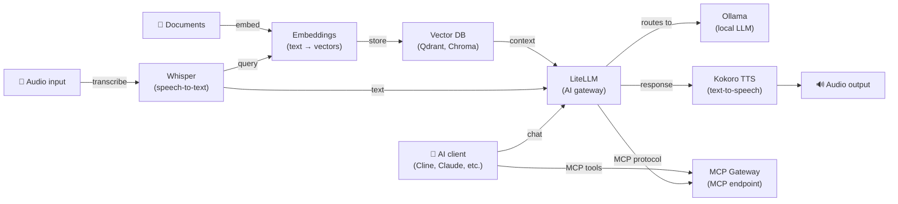

[English](README.md) | [简体中文](README-zh.md) | [繁體中文](README-zh-Hant.md) | [Русский](README-ru.md)

# Docker AI Stack

[](https://opensource.org/licenses/MIT)

Deploy a complete, self-hosted AI stack on your own server with a single command. All services auto-configure with secure defaults on first start. Audio processing (Whisper, Kokoro), embeddings, and LLM inference (Ollama) all run locally. When using LiteLLM with external providers (e.g., OpenAI, Anthropic), your data will be sent to those providers.

**Services included:**

| Service | Role | Default port |
|---|---|---|
| **[Ollama (LLM)](https://github.com/hwdsl2/docker-ollama)** | Runs local LLM models (llama3, qwen, mistral, etc.) | `11434` |
| **[LiteLLM](https://github.com/hwdsl2/docker-litellm)** | AI gateway — routes requests to Ollama, OpenAI, Anthropic, and 100+ providers | `4000` |
| **[Embeddings](https://github.com/hwdsl2/docker-embeddings)** | Converts text to vectors for semantic search and RAG | `8000` |
| **[Whisper (STT)](https://github.com/hwdsl2/docker-whisper)** | Transcribes spoken audio to text | `9000` |
| **[Kokoro (TTS)](https://github.com/hwdsl2/docker-kokoro)** | Converts text to natural-sounding speech | `8880` |
| **[MCP Gateway](https://github.com/hwdsl2/docker-mcp-gateway)** | Provides MCP tools (filesystem, fetch, GitHub, search, databases) to AI clients | `3000` |

**Also available:**

- AI/Audio: [WhisperLive (real-time STT)](https://github.com/hwdsl2/docker-whisper-live)
- VPN: [WireGuard](https://github.com/hwdsl2/docker-wireguard), [OpenVPN](https://github.com/hwdsl2/docker-openvpn), [IPsec VPN](https://github.com/hwdsl2/docker-ipsec-vpn-server), [Headscale](https://github.com/hwdsl2/docker-headscale)

## Architecture



## Quick start

**Requirements:**

- A Linux server (local or cloud) with Docker installed
- At least 8 GB of RAM (with small models). For larger LLM models (8B+), 32 GB or more is recommended.
- You can comment out services you don't need to reduce memory usage.

**Start the full stack:**

```bash
# Clone the repository to get the compose files
git clone https://github.com/hwdsl2/docker-ai-stack
cd docker-ai-stack
docker compose up -d
```

Check the logs to confirm all services are ready:

```bash
docker compose logs
```

**Get the API keys:**

```bash
# Ollama API key
docker exec ollama ollama_manage --showkey

# LiteLLM API key
docker exec litellm litellm_manage --getkey

# MCP Gateway API key
docker exec mcp mcp_manage --getkey
```

**Stop the stack:**

```bash
docker compose down
```

## GPU acceleration (NVIDIA CUDA)

For NVIDIA GPU acceleration, use the CUDA compose file:

```bash
docker compose -f docker-compose.cuda.yml up -d
```

**Requirements:** NVIDIA GPU, [NVIDIA driver](https://www.nvidia.com/en-us/drivers/) 535+, and the [NVIDIA Container Toolkit](https://docs.nvidia.com/datacenter/cloud-native/container-toolkit/latest/install-guide.html) installed on the host. CUDA images are `linux/amd64` only.

## Connect MCP Gateway to LiteLLM

```yaml
# In your LiteLLM config, add the MCP gateway as a tool source:
mcp_servers:
  - url: http://mcp:3000/mcp
    transport: sse
    headers:
      Authorization: "Bearer <mcp_api_key>"
```

## Voice pipeline example

Transcribe a spoken question, get a local LLM response via Ollama, and convert it to speech:

```bash
LITELLM_KEY=$(docker exec litellm litellm_manage --getkey)

# Step 1: Transcribe audio to text (Whisper)
TEXT=$(curl -s http://localhost:9000/v1/audio/transcriptions \
    -F file=@question.mp3 -F model=whisper-1 | jq -r .text)

# Step 2: Send text to Ollama via LiteLLM and get a response
RESPONSE=$(curl -s http://localhost:4000/v1/chat/completions \
    -H "Authorization: Bearer $LITELLM_KEY" \
    -H "Content-Type: application/json" \
    -d "{\"model\":\"ollama/llama3.2:3b\",\"messages\":[{\"role\":\"user\",\"content\":\"$TEXT\"}]}" \
    | jq -r '.choices[0].message.content')

# Step 3: Convert the response to speech (Kokoro TTS)
curl -s http://localhost:8880/v1/audio/speech \
    -H "Content-Type: application/json" \
    -d "{\"model\":\"tts-1\",\"input\":\"$RESPONSE\",\"voice\":\"af_heart\"}" \
    --output response.mp3
```

## RAG pipeline example

Embed documents for semantic search, retrieve context, then answer questions with a local Ollama model:

```bash
LITELLM_KEY=$(docker exec litellm litellm_manage --getkey)

# Step 1: Embed a document chunk and store the vector in your vector DB
curl -s http://localhost:8000/v1/embeddings \
    -H "Content-Type: application/json" \
    -d '{"input": "Docker simplifies deployment by packaging apps in containers.", "model": "text-embedding-ada-002"}' \
    | jq '.data[0].embedding'
# → Store the returned vector alongside the source text in Qdrant, Chroma, pgvector, etc.

# Step 2: At query time, embed the question, retrieve the top matching chunks from
#          the vector DB, then send the question and retrieved context to Ollama via LiteLLM.
curl -s http://localhost:4000/v1/chat/completions \
    -H "Authorization: Bearer $LITELLM_KEY" \
    -H "Content-Type: application/json" \
    -d '{
      "model": "ollama/llama3.2:3b",
      "messages": [
        {"role": "system", "content": "Answer using only the provided context."},
        {"role": "user", "content": "What does Docker do?\n\nContext: Docker simplifies deployment by packaging apps in containers."}
      ]
    }' \
    | jq -r '.choices[0].message.content'
```

## MCP tools example

Use MCP Gateway to give your AI assistant access to files, web, and GitHub:

```bash
MCP_KEY=$(docker exec mcp mcp_manage --getkey)

# Use MCP endpoint with an AI client (e.g., Cline in VS Code)
# Set the MCP server URL: http://localhost:3000/mcp
# Set Authorization header: Bearer <api_key>

# Or test the MCP endpoint directly with an initialize request
curl -s http://localhost:3000/mcp \
    -X POST \
    -H "Authorization: Bearer $MCP_KEY" \
    -H "Content-Type: application/json" \
    -H "Accept: application/json, text/event-stream" \
    -d '{"jsonrpc":"2.0","id":1,"method":"initialize","params":{"protocolVersion":"2025-03-26","capabilities":{},"clientInfo":{"name":"test","version":"1.0"}}}'
```

## Customization

Each service can be configured with an optional env file. Copy the example env file from the respective repository, edit it, and uncomment the volume mount in `docker-compose.yml`:

| Service | Env file | Repository |
|---|---|---|
| Ollama | `ollama.env` | [docker-ollama](https://github.com/hwdsl2/docker-ollama) |
| LiteLLM | `litellm.env` | [docker-litellm](https://github.com/hwdsl2/docker-litellm) |
| Embeddings | `embed.env` | [docker-embeddings](https://github.com/hwdsl2/docker-embeddings) |
| Whisper | `whisper.env` | [docker-whisper](https://github.com/hwdsl2/docker-whisper) |
| Kokoro | `kokoro.env` | [docker-kokoro](https://github.com/hwdsl2/docker-kokoro) |
| MCP Gateway | `mcp.env` | [docker-mcp-gateway](https://github.com/hwdsl2/docker-mcp-gateway) |

For detailed configuration options, API reference, and model management, see the documentation in each service's repository.

## Update images

To update all services to the latest versions:

```bash
docker compose pull
docker compose up -d
```

Your data is preserved in the Docker volumes.

## License

Copyright (C) 2026 Lin Song   
This work is licensed under the [MIT License](https://opensource.org/licenses/MIT).

This project is an independent Docker configuration and is not affiliated with, endorsed by, or sponsored by Ollama, Berri AI (LiteLLM), Hugging Face, hexgrad (Kokoro), OpenAI, SYSTRAN, or MCPHub.
