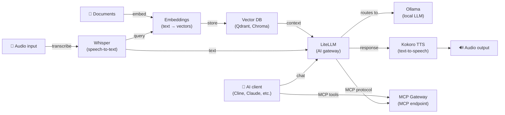

[English](README.md) | [简体中文](README-zh.md) | [繁體中文](README-zh-Hant.md) | [Русский](README-ru.md)

# Docker AI Stack

[](https://docs.docker.com/compose/) &nbsp;[](https://opensource.org/licenses/MIT)

Deploy a complete, self-hosted AI stack on your own server with a single command.

- Zero-config: all services auto-configure on first start
- Secure: Ollama, LiteLLM, and MCP Gateway generate API keys automatically
- Private: audio, embeddings, and LLM inference all run locally — no data sent to third parties
- Optional auth: Whisper, Kokoro, and Embeddings work without API keys by default (set keys via env files for public deployments)
- [Lightweight stacks](#lightweight-stacks) for lower memory requirements (as low as ~2.5 GB)
- GPU acceleration via NVIDIA CUDA

**Note:** When using LiteLLM with external providers (e.g., OpenAI, Anthropic), your data will be sent to those providers.

**Services included:**

| Service | Role | Default port |
|---|---|---|
| **[Ollama (LLM)](https://github.com/hwdsl2/docker-ollama)** | Runs local LLM models (llama3, qwen, mistral, etc.) | `11434` |
| **[LiteLLM](https://github.com/hwdsl2/docker-litellm)** | AI gateway — routes requests to Ollama, OpenAI, Anthropic, and 100+ providers | `4000` |
| **[Embeddings](https://github.com/hwdsl2/docker-embeddings)** | Converts text to vectors for semantic search and RAG | `8000` |
| **[Whisper (STT)](https://github.com/hwdsl2/docker-whisper)** | Transcribes spoken audio to text | `9000` |
| **[Kokoro (TTS)](https://github.com/hwdsl2/docker-kokoro)** | Converts text to natural-sounding speech | `8880` |
| **[MCP Gateway](https://github.com/hwdsl2/docker-mcp-gateway)** | Provides MCP tools (filesystem, fetch, GitHub, search, databases) to AI clients | `3000` |

**Also available:**

- AI/Audio: [WhisperLive (real-time STT)](https://github.com/hwdsl2/docker-whisper-live)
- VPN: [WireGuard](https://github.com/hwdsl2/docker-wireguard), [OpenVPN](https://github.com/hwdsl2/docker-openvpn), [IPsec VPN](https://github.com/hwdsl2/docker-ipsec-vpn-server), [Headscale](https://github.com/hwdsl2/docker-headscale)

## Architecture



## Quick start

**Requirements:**

- A Linux server (local or cloud) with Docker installed
- At least 8 GB of RAM (with small models). For larger LLM models (8B+), 32 GB or more is recommended.
- You can comment out services you don't need to reduce memory usage.

**Start the full stack:**

```bash
# Clone the repository to get the compose files
git clone https://github.com/hwdsl2/docker-ai-stack
cd docker-ai-stack
docker compose up -d
```

**Pull a model** (required before making LLM requests):

```bash
docker exec ollama ollama_manage --pull llama3.2:3b
```

Check the logs to confirm all services are ready:

```bash
docker compose logs
```

Run the health check to verify all services are working:

```bash
./stack-check.sh
```

**Get the API keys:**

```bash
# Ollama API key
docker exec ollama ollama_manage --showkey

# LiteLLM API key
docker exec litellm litellm_manage --showkey

# MCP Gateway API key
docker exec mcp mcp_manage --showkey
```

**Stop the stack:**

```bash
docker compose down
```

## GPU acceleration (NVIDIA CUDA)

For NVIDIA GPU acceleration, use the CUDA compose file:

```bash
docker compose -f docker-compose.cuda.yml up -d
```

**Requirements:** NVIDIA GPU, [NVIDIA driver](https://www.nvidia.com/en-us/drivers/) 535+, and the [NVIDIA Container Toolkit](https://docs.nvidia.com/datacenter/cloud-native/container-toolkit/latest/install-guide.html) installed on the host. CUDA images are `linux/amd64` only.

## Lightweight stacks

Don't need the full stack? Use a pre-configured subset from the `stacks/` folder:

| Stack | Services | Memory | Use case |
|---|---|---|---|
| **[voice-pipeline](stacks/voice-pipeline/)** | Whisper + Ollama + LiteLLM + Kokoro | ~5 GB | Speech-to-text → LLM → text-to-speech |
| **[rag-pipeline](stacks/rag-pipeline/)** | Ollama + LiteLLM + Embeddings | ~3 GB | Semantic search + LLM Q&A |
| **[ai-tools](stacks/ai-tools/)** | Ollama + LiteLLM + MCP Gateway | ~3 GB | AI coding assistant with tool access |
| **[chat-only](stacks/chat-only/)** | Ollama + LiteLLM | ~2.5 GB | Minimal local ChatGPT replacement |

```bash
git clone https://github.com/hwdsl2/docker-ai-stack
cd docker-ai-stack/stacks/voice-pipeline  # or rag-pipeline, ai-tools, chat-only
docker compose up -d
```

## Running without Docker Compose

If you prefer using `docker run` commands directly, first create a shared network so services can communicate:

```bash
docker network create ai-stack
```

Then start each service on the shared network:

```bash
# Ollama (LLM)
docker run -d --name ollama --restart always \
    --network ai-stack \
    -v ollama-data:/var/lib/ollama \
    hwdsl2/ollama-server

# LiteLLM (AI gateway)
docker run -d --name litellm --restart always \
    --network ai-stack \
    -p 4000:4000 \
    -e LITELLM_OLLAMA_BASE_URL=http://ollama:11434 \
    -v litellm-data:/etc/litellm \
    hwdsl2/litellm-server

# Embeddings
docker run -d --name embeddings --restart always \
    --network ai-stack \
    -p 8000:8000 \
    -v embeddings-data:/var/lib/embeddings \
    hwdsl2/embeddings-server

# Whisper (STT)
docker run -d --name whisper --restart always \
    --network ai-stack \
    -p 9000:9000 \
    -v whisper-data:/var/lib/whisper \
    hwdsl2/whisper-server

# Kokoro (TTS)
docker run -d --name kokoro --restart always \
    --network ai-stack \
    -p 8880:8880 \
    -v kokoro-data:/var/lib/kokoro \
    hwdsl2/kokoro-server

# MCP Gateway
docker run -d --name mcp --restart always \
    --network ai-stack \
    -p 3000:3000 \
    -v mcp-data:/var/lib/mcp \
    hwdsl2/mcp-gateway
```

**Note:** The shared network allows services to reach each other by container name (e.g., LiteLLM connects to Ollama via `http://ollama:11434`). You can start only the services you need — they don't all have to run together.

**Pull a model** (required before making LLM requests):

```bash
docker exec ollama ollama_manage --pull llama3.2:3b
```

## Connect MCP Gateway to LiteLLM

LiteLLM and MCP Gateway are **automatically wired** when using the compose files in this repository — no manual key setup is needed.

API keys are shared automatically between services via Docker shared volumes:

- Ollama generates an API key on first start and copies it to a shared volume
- MCP Gateway does the same
- LiteLLM reads both keys from the shared volumes on startup

The `LITELLM_MCP_URL=http://mcp:3000/mcp` and `LITELLM_OLLAMA_BASE_URL=http://ollama:11434` environment variables are pre-configured in the compose files, so all services are connected automatically with a single `docker compose up -d`.

Once connected, AI clients that call LiteLLM can use MCP tools (filesystem, fetch, GitHub, etc.) directly through the LiteLLM proxy.

## Voice pipeline example

Transcribe a spoken question, get a local LLM response via Ollama, and convert it to speech:

**Tip:** Need a sample audio file? Download this English speech sample (WAV, MIT License) from the [Azure Samples](https://github.com/Azure-Samples/cognitive-services-speech-sdk) repository:

```bash
curl -L -o sample_speech.wav \
    "https://github.com/Azure-Samples/cognitive-services-speech-sdk/raw/master/sampledata/audiofiles/katiesteve.wav"
```

```bash
LITELLM_KEY=$(docker exec litellm litellm_manage --showkey | grep '^sk-' | head -1)

# Step 1: Transcribe audio to text (Whisper)
TEXT=$(curl -s http://localhost:9000/v1/audio/transcriptions \
    -F file=@sample_speech.wav -F model=whisper-1 | jq -r .text)

# Step 2: Send text to Ollama via LiteLLM and get a response
RESPONSE=$(curl -s http://localhost:4000/v1/chat/completions \
    -H "Authorization: Bearer $LITELLM_KEY" \
    -H "Content-Type: application/json" \
    -d "{\"model\":\"ollama/llama3.2:3b\",\"messages\":[{\"role\":\"user\",\"content\":\"$TEXT\"}]}" \
    | jq -r '.choices[0].message.content')

# Step 3: Convert the response to speech (Kokoro TTS)
curl -s http://localhost:8880/v1/audio/speech \
    -H "Content-Type: application/json" \
    -d "{\"model\":\"tts-1\",\"input\":\"$RESPONSE\",\"voice\":\"af_heart\"}" \
    --output response.mp3
```

## RAG pipeline example

Embed documents for semantic search, retrieve context, then answer questions with a local Ollama model:

```bash
LITELLM_KEY=$(docker exec litellm litellm_manage --showkey | grep '^sk-' | head -1)

# Step 1: Embed a document chunk and store the vector in your vector DB
curl -s http://localhost:8000/v1/embeddings \
    -H "Content-Type: application/json" \
    -d '{"input": "Docker simplifies deployment by packaging apps in containers.", "model": "text-embedding-ada-002"}' \
    | jq '.data[0].embedding'
# → Store the returned vector alongside the source text in Qdrant, Chroma, pgvector, etc.

# Step 2: At query time, embed the question, retrieve the top matching chunks from
#          the vector DB, then send the question and retrieved context to Ollama via LiteLLM.
curl -s http://localhost:4000/v1/chat/completions \
    -H "Authorization: Bearer $LITELLM_KEY" \
    -H "Content-Type: application/json" \
    -d '{
      "model": "ollama/llama3.2:3b",
      "messages": [
        {"role": "system", "content": "Answer using only the provided context."},
        {"role": "user", "content": "What does Docker do?\n\nContext: Docker simplifies deployment by packaging apps in containers."}
      ]
    }' \
    | jq -r '.choices[0].message.content'
```

## MCP tools example

Use MCP Gateway to give your AI assistant access to files, web, and GitHub:

```bash
MCP_KEY=$(docker exec mcp mcp_manage --showkey | grep '^mcp-' | head -1)

# Use MCP endpoint with an AI client (e.g., Cline in VS Code)
# Set the MCP server URL: http://localhost:3000/mcp
# Set Authorization header: Bearer <api_key>

# Or test the MCP endpoint directly with an initialize request
curl -s http://localhost:3000/mcp \
    -X POST \
    -H "Authorization: Bearer $MCP_KEY" \
    -H "Content-Type: application/json" \
    -H "Accept: application/json, text/event-stream" \
    -d '{"jsonrpc":"2.0","id":1,"method":"initialize","params":{"protocolVersion":"2025-03-26","capabilities":{},"clientInfo":{"name":"test","version":"1.0"}}}'
```

## Customization

Each service can be configured with an optional env file. Copy the example env file from the respective repository, edit it, and uncomment the volume mount in `docker-compose.yml`:

| Service | Env file | Repository |
|---|---|---|
| Ollama | `ollama.env` | [docker-ollama](https://github.com/hwdsl2/docker-ollama) |
| LiteLLM | `litellm.env` | [docker-litellm](https://github.com/hwdsl2/docker-litellm) |
| Embeddings | `embed.env` | [docker-embeddings](https://github.com/hwdsl2/docker-embeddings) |
| Whisper | `whisper.env` | [docker-whisper](https://github.com/hwdsl2/docker-whisper) |
| Kokoro | `kokoro.env` | [docker-kokoro](https://github.com/hwdsl2/docker-kokoro) |
| MCP Gateway | `mcp.env` | [docker-mcp-gateway](https://github.com/hwdsl2/docker-mcp-gateway) |

For detailed configuration options, API reference, and model management, see the documentation in each service's repository.

## Backup and restore

Your API keys, models, and configuration are stored in Docker volumes. Back up before upgrading or making changes:

```bash
# Export API keys (while containers are running)
docker exec ollama ollama_manage --showkey
docker exec litellm litellm_manage --showkey
docker exec mcp mcp_manage --showkey

# Back up all volumes (stop services first)
docker compose down
mkdir -p backups
for vol in ollama-data litellm-data embeddings-data whisper-data kokoro-data mcp-data; do
  docker volume inspect "$vol" >/dev/null 2>&1 && \
    docker run --rm -v "${vol}:/source:ro" -v "$(pwd)/backups:/backup" \
      alpine tar czf "/backup/${vol}.tar.gz" -C /source .
done
```

**Note:** The `ollama-shared` and `mcp-shared` volumes are ephemeral key-sharing volumes and do not need to be backed up.

For restore instructions, server migration, and the full pre-upgrade checklist, see the [Backup and Restore](docs/backup-restore.md) guide.

## Update images

To update all services to the latest versions:

```bash
docker compose pull
docker compose up -d
./stack-check.sh
```

Your data is preserved in the Docker volumes. **Always [back up](#backup-and-restore) before upgrading.**

## License

Copyright (C) 2026 Lin Song   
This work is licensed under the [MIT License](https://opensource.org/licenses/MIT).

This project is an independent Docker configuration and is not affiliated with, endorsed by, or sponsored by Ollama, Berri AI (LiteLLM), Hugging Face, hexgrad (Kokoro), OpenAI, SYSTRAN, or MCPHub.
