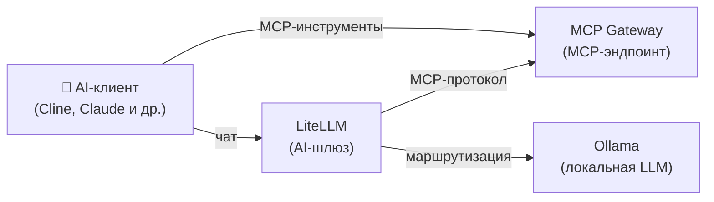

[English](README.md) | [简体中文](README-zh.md) | [繁體中文](README-zh-Hant.md) | [Русский](README-ru.md)

# AI-инструменты

Локальная LLM с доступом к MCP-инструментам для AI-ассистентов разработки (Cline, Claude, Cursor и др.).

**Сервисы:** Ollama (LLM) + LiteLLM (шлюз) + MCP Gateway

**Память:** ~3 ГБ RAM (с моделью 3B)

## Архитектура



## Сервисы

| Сервис | Назначение | Порт по умолчанию |
|---|---|---|
| **[Ollama (LLM)](https://github.com/hwdsl2/docker-ollama/blob/main/README-ru.md)** | Запускает локальные LLM-модели (llama3, qwen, mistral и др.) | `11434` |
| **[LiteLLM](https://github.com/hwdsl2/docker-litellm/blob/main/README-ru.md)** | AI-шлюз с панелью администратора — маршрутизирует запросы к Ollama и 100+ провайдерам | `4000` |
| **[MCP Gateway](https://github.com/hwdsl2/docker-mcp-gateway/blob/main/README-ru.md)** | Предоставляет MCP-инструменты (файловая система, fetch, GitHub, поиск, БД) AI-клиентам | `3000` |

## Быстрый старт

```bash
git clone https://github.com/hwdsl2/docker-ai-stack
cd docker-ai-stack/stacks/ai-tools
docker compose up -d
```

**Загрузка модели** (обязательно перед отправкой LLM-запросов):

```bash
docker exec ollama ollama_manage --pull llama3.2:3b
```

## GPU-ускорение (NVIDIA CUDA)

Для GPU-ускорения NVIDIA используйте CUDA compose-файл:

```bash
docker compose -f docker-compose.cuda.yml up -d
```

**Требования:** GPU NVIDIA, [драйвер NVIDIA](https://www.nvidia.com/en-us/drivers/) 535+, и [NVIDIA Container Toolkit](https://docs.nvidia.com/datacenter/cloud-native/container-toolkit/latest/install-guide.html), установленный на хосте. CUDA-образы поддерживают только `linux/amd64`.

## Запуск без Docker Compose

Если вы предпочитаете использовать команды `docker run` напрямую, сначала создайте общую сеть для связи между сервисами:

```bash
docker network create ai-stack
```

Затем запустите каждый сервис в общей сети:

```bash
# Ollama (LLM)
docker run -d --name ollama --restart always \
    --network ai-stack \
    -v ollama-data:/var/lib/ollama \
    hwdsl2/ollama-server

# LiteLLM (AI-шлюз)
docker run -d --name litellm --restart always \
    --network ai-stack \
    -p 4000:4000 \
    -e LITELLM_OLLAMA_BASE_URL=http://ollama:11434 \
    -v litellm-data:/etc/litellm \
    hwdsl2/litellm-server

# MCP Gateway
docker run -d --name mcp --restart always \
    --network ai-stack \
    -v mcp-data:/var/lib/mcp \
    hwdsl2/mcp-gateway
```

**Примечание:** Общая сеть позволяет сервисам обращаться друг к другу по имени контейнера (например, LiteLLM подключается к Ollama через `http://ollama:11434`).

**Загрузка модели** (обязательно перед отправкой LLM-запросов):

```bash
docker exec ollama ollama_manage --pull llama3.2:3b
```

## Проверка развёртывания

После запуска стека можно проверить, что все сервисы работают корректно:

```bash
# Выполните из корневой директории docker-ai-stack
../../stack-check.sh
```

**Доступ к панели администратора LiteLLM:**

Откройте `http://<server-ip>:4000/ui` в браузере. Войдите с именем пользователя `admin` и вашим мастер-ключом LiteLLM в качестве пароля. Панель администратора предоставляет управление виртуальными ключами, отслеживание расходов и настройку моделей.

**Примечание:** Для развёртываний с выходом в интернет настоятельно рекомендуется использовать [обратный прокси](#развёртывание-с-доступом-из-интернета) для добавления HTTPS. В этом случае также измените `"4000:4000/tcp"` на `"127.0.0.1:4000:4000/tcp"` в `docker-compose.yml`, чтобы предотвратить прямой доступ к незашифрованному порту.

**Попробуйте в Playground:**

В панели администратора нажмите **Playground** в левом меню. Выберите локальную модель (например, `ollama/llama3.2:3b`) из выпадающего списка и начните общаться — это быстрый способ убедиться, что локальная языковая модель работает сквозным образом.

## Настройка

Каждый сервис можно настроить с помощью опционального env-файла. Скопируйте пример env-файла из соответствующего репозитория, отредактируйте его и раскомментируйте монтирование тома в `docker-compose.yml`:

| Сервис | Env-файл | Репозиторий |
|---|---|---|
| Ollama | `ollama.env` | [docker-ollama](https://github.com/hwdsl2/docker-ollama/blob/main/README-ru.md) |
| LiteLLM | `litellm.env` | [docker-litellm](https://github.com/hwdsl2/docker-litellm/blob/main/README-ru.md) |
| MCP Gateway | `mcp.env` | [docker-mcp-gateway](https://github.com/hwdsl2/docker-mcp-gateway/blob/main/README-ru.md) |

Подробные параметры настройки, справочник API и управление моделями описаны в документации каждого сервиса.

## Развёртывание с доступом из интернета

По умолчанию все сервисы слушают по незашифрованному HTTP. Для развёртываний с доступом из интернета установите обратный прокси (например, [Caddy](https://caddyserver.com/), Nginx или Traefik) перед стеком для обеспечения HTTPS. Каждый репозиторий сервиса содержит подробное [руководство по обратному прокси](https://github.com/hwdsl2/docker-litellm/blob/main/README-ru.md#использование-обратного-прокси) с примерами для Caddy и nginx.

## Обновление образов

Обновление всех сервисов до последних версий:

```bash
docker compose pull
docker compose up -d
```

Ваши данные сохраняются в Docker-томах.

## Подключение MCP Gateway к LiteLLM

LiteLLM и MCP Gateway **автоматически подключены** в compose-файле. `LITELLM_MCP_URL=http://mcp:3000/mcp` уже задан, поэтому LiteLLM автоматически добавляет блок `mcp_servers:` в конфигурацию после установки API-ключа.

Для завершения настройки задайте API-ключ MCP после первого запуска:

```bash
# 1. Получите API-ключ MCP Gateway
docker exec mcp mcp_manage --showkey

# 2. Добавьте его в litellm.env (или передайте как переменную окружения) и перезапустите:
#    LITELLM_MCP_API_KEY=mcp-xxxx...
docker compose restart litellm
```

Альтернативно: задайте `MCP_API_KEY=my-key` в `mcp.env` и укажите то же значение для `LITELLM_MCP_API_KEY` в `litellm.env` до запуска — тогда перезапуск не потребуется.

## Использование

```bash
# Получение API-ключей
LITELLM_KEY=$(docker exec litellm litellm_manage --getkey)
MCP_KEY=$(docker exec mcp mcp_manage --showkey | grep '^mcp-' | head -1)

# Используйте с AI-клиентом (например, Cline в VS Code):
# LLM-эндпоинт: http://localhost:4000 (с LITELLM_KEY)
# MCP-эндпоинт: http://localhost:3000/mcp (с MCP_KEY)