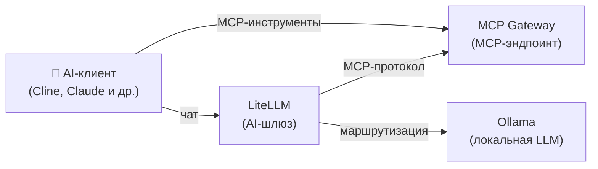

[English](README.md) | [简体中文](README-zh.md) | [繁體中文](README-zh-Hant.md) | [Русский](README-ru.md)

# AI-инструменты

Локальная LLM с доступом к MCP-инструментам для AI-ассистентов разработки (Cline, Claude, Cursor и др.).

**Сервисы:** Ollama (LLM) + LiteLLM (шлюз) + MCP Gateway

**Память:** ~3 ГБ RAM (с моделью 3B)

## Архитектура



## Сервисы

| Сервис | Назначение | Порт по умолчанию |
|---|---|---|
| **[Ollama (LLM)](https://github.com/hwdsl2/docker-ollama)** | Запускает локальные LLM-модели (llama3, qwen, mistral и др.) | `11434` |
| **[LiteLLM](https://github.com/hwdsl2/docker-litellm)** | AI-шлюз — маршрутизирует запросы к Ollama и 100+ провайдерам | `4000` |
| **[MCP Gateway](https://github.com/hwdsl2/docker-mcp-gateway)** | Предоставляет MCP-инструменты (файловая система, fetch, GitHub, поиск, БД) AI-клиентам | `3000` |

## Быстрый старт

```bash
git clone https://github.com/hwdsl2/docker-ai-stack
cd docker-ai-stack/stacks/ai-tools
docker compose up -d
```

**Загрузка модели** (обязательно перед отправкой LLM-запросов):

```bash
docker exec ollama ollama_manage --pull llama3.2:3b
```

## Запуск без Docker Compose

Если вы предпочитаете использовать команды `docker run` напрямую, сначала создайте общую сеть для связи между сервисами:

```bash
docker network create ai-stack
```

Затем запустите каждый сервис в общей сети:

```bash
# Ollama (LLM)
docker run -d --name ollama --restart always \
    --network ai-stack \
    -v ollama-data:/var/lib/ollama \
    hwdsl2/ollama-server

# LiteLLM (AI-шлюз)
docker run -d --name litellm --restart always \
    --network ai-stack \
    -p 4000:4000 \
    -e LITELLM_OLLAMA_BASE_URL=http://ollama:11434 \
    -v litellm-data:/etc/litellm \
    hwdsl2/litellm-server

# MCP Gateway
docker run -d --name mcp --restart always \
    --network ai-stack \
    -p 3000:3000 \
    -v mcp-data:/var/lib/mcp \
    hwdsl2/mcp-gateway
```

**Примечание:** Общая сеть позволяет сервисам обращаться друг к другу по имени контейнера (например, LiteLLM подключается к Ollama через `http://ollama:11434`).

**Загрузка модели** (обязательно перед отправкой LLM-запросов):

```bash
docker exec ollama ollama_manage --pull llama3.2:3b
```

## Настройка

Каждый сервис можно настроить с помощью опционального env-файла. Скопируйте пример env-файла из соответствующего репозитория, отредактируйте его и раскомментируйте монтирование тома в `docker-compose.yml`:

| Сервис | Env-файл | Репозиторий |
|---|---|---|
| Ollama | `ollama.env` | [docker-ollama](https://github.com/hwdsl2/docker-ollama) |
| LiteLLM | `litellm.env` | [docker-litellm](https://github.com/hwdsl2/docker-litellm) |
| MCP Gateway | `mcp.env` | [docker-mcp-gateway](https://github.com/hwdsl2/docker-mcp-gateway) |

Подробные параметры настройки, справочник API и управление моделями описаны в документации каждого сервиса.

## Обновление образов

Обновление всех сервисов до последних версий:

```bash
docker compose pull
docker compose up -d
```

Ваши данные сохраняются в Docker-томах.

## Использование

```bash
# Получение API-ключей
LITELLM_KEY=$(docker exec litellm litellm_manage --getkey)
MCP_KEY=$(docker exec mcp mcp_manage --getkey)

# Подключите MCP Gateway к LiteLLM, добавив в конфигурацию LiteLLM:
# mcp_servers:
#   - url: http://mcp:3000/mcp
#     transport: sse
#     headers:
#       Authorization: "Bearer <mcp_api_key>"

# Используйте с AI-клиентом (например, Cline в VS Code):
# LLM-эндпоинт: http://localhost:4000 (с LITELLM_KEY)
# MCP-эндпоинт: http://localhost:3000/mcp (с MCP_KEY)