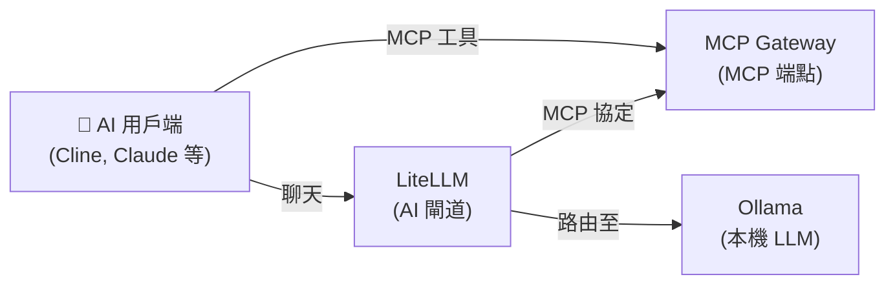

[English](README.md) | [简体中文](README-zh.md) | [繁體中文](README-zh-Hant.md) | [Русский](README-ru.md)

# AI 工具

本機 LLM 搭配 MCP 工具存取，適用於 AI 程式設計助手（Cline、Claude、Cursor 等）。

**服務：** Ollama (LLM) + LiteLLM (閘道) + MCP Gateway

**記憶體：** ~3 GB RAM（使用 3B 模型）

## 架構



## 服務

| 服務 | 用途 | 預設連接埠 |
|---|---|---|
| **[Ollama (LLM)](https://github.com/hwdsl2/docker-ollama)** | 執行本機 LLM 模型（llama3、qwen、mistral 等） | `11434` |
| **[LiteLLM](https://github.com/hwdsl2/docker-litellm)** | AI 閘道 — 將請求路由至 Ollama 及 100+ 供應商 | `4000` |
| **[MCP Gateway](https://github.com/hwdsl2/docker-mcp-gateway)** | 為 AI 用戶端提供 MCP 工具（檔案系統、fetch、GitHub、搜尋、資料庫） | `3000` |

## 快速開始

```bash
git clone https://github.com/hwdsl2/docker-ai-stack
cd docker-ai-stack/stacks/ai-tools
docker compose up -d
```

**拉取模型**（發出 LLM 請求前必須執行）：

```bash
docker exec ollama ollama_manage --pull llama3.2:3b
```

## 不使用 Docker Compose 執行

如需直接使用 `docker run` 指令，請先建立共享網路以便服務之間通訊：

```bash
docker network create ai-stack
```

然後在共享網路上啟動各服務：

```bash
# Ollama (LLM)
docker run -d --name ollama --restart always \
    --network ai-stack \
    -v ollama-data:/var/lib/ollama \
    hwdsl2/ollama-server

# LiteLLM (AI 閘道)
docker run -d --name litellm --restart always \
    --network ai-stack \
    -p 4000:4000 \
    -e LITELLM_OLLAMA_BASE_URL=http://ollama:11434 \
    -v litellm-data:/etc/litellm \
    hwdsl2/litellm-server

# MCP Gateway
docker run -d --name mcp --restart always \
    --network ai-stack \
    -p 3000:3000 \
    -v mcp-data:/var/lib/mcp \
    hwdsl2/mcp-gateway
```

**注：** 共享網路允許服務透過容器名稱互相存取（例如 LiteLLM 透過 `http://ollama:11434` 連接 Ollama）。

**拉取模型**（發出 LLM 請求前必須執行）：

```bash
docker exec ollama ollama_manage --pull llama3.2:3b
```

## 自訂設定

每個服務可以透過可選的 env 檔案進行設定。從相應儲存庫複製範例 env 檔案，編輯後取消 `docker-compose.yml` 中的磁碟區掛載註解：

| 服務 | Env 檔案 | 儲存庫 |
|---|---|---|
| Ollama | `ollama.env` | [docker-ollama](https://github.com/hwdsl2/docker-ollama) |
| LiteLLM | `litellm.env` | [docker-litellm](https://github.com/hwdsl2/docker-litellm) |
| MCP Gateway | `mcp.env` | [docker-mcp-gateway](https://github.com/hwdsl2/docker-mcp-gateway) |

有關詳細設定選項、API 參考和模型管理，請參閱各服務儲存庫的文件。

## 更新映像檔

將所有服務更新到最新版本：

```bash
docker compose pull
docker compose up -d
```

您的資料保存在 Docker 磁碟區中。

## 使用方法

```bash
# 取得 API 金鑰
LITELLM_KEY=$(docker exec litellm litellm_manage --getkey)
MCP_KEY=$(docker exec mcp mcp_manage --getkey)

# 將 MCP Gateway 連接到 LiteLLM，在 LiteLLM 設定中新增：
# mcp_servers:
#   - url: http://mcp:3000/mcp
#     transport: sse
#     headers:
#       Authorization: "Bearer <mcp_api_key>"

# 在 AI 用戶端中使用（例如 VS Code 中的 Cline）：
# LLM 端點：http://localhost:4000（使用 LITELLM_KEY）
# MCP 端點：http://localhost:3000/mcp（使用 MCP_KEY）