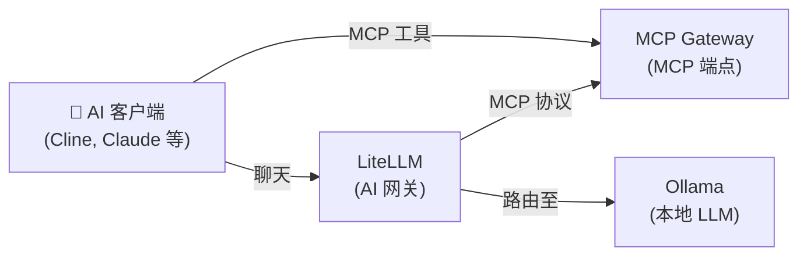

[English](README.md) | [简体中文](README-zh.md) | [繁體中文](README-zh-Hant.md) | [Русский](README-ru.md)

# AI 工具

本地 LLM 搭配 MCP 工具访问，适用于 AI 编程助手（Cline、Claude、Cursor 等）。

**服务：** Ollama (LLM) + LiteLLM (网关) + MCP Gateway

**内存：** ~3 GB RAM（使用 3B 模型）

## 架构



## 服务

| 服务 | 用途 | 默认端口 |
|---|---|---|
| **[Ollama (LLM)](https://github.com/hwdsl2/docker-ollama)** | 运行本地 LLM 模型（llama3、qwen、mistral 等） | `11434` |
| **[LiteLLM](https://github.com/hwdsl2/docker-litellm)** | AI 网关 — 将请求路由至 Ollama 及 100+ 供应商 | `4000` |
| **[MCP Gateway](https://github.com/hwdsl2/docker-mcp-gateway)** | 为 AI 客户端提供 MCP 工具（文件系统、fetch、GitHub、搜索、数据库） | `3000` |

## 快速开始

```bash
git clone https://github.com/hwdsl2/docker-ai-stack
cd docker-ai-stack/stacks/ai-tools
docker compose up -d
```

**拉取模型**（发出 LLM 请求前必须执行）：

```bash
docker exec ollama ollama_manage --pull llama3.2:3b
```

## 不使用 Docker Compose 运行

如需直接使用 `docker run` 命令，请先创建共享网络以便服务之间通信：

```bash
docker network create ai-stack
```

然后在共享网络上启动各服务：

```bash
# Ollama (LLM)
docker run -d --name ollama --restart always \
    --network ai-stack \
    -v ollama-data:/var/lib/ollama \
    hwdsl2/ollama-server

# LiteLLM (AI 网关)
docker run -d --name litellm --restart always \
    --network ai-stack \
    -p 4000:4000 \
    -e LITELLM_OLLAMA_BASE_URL=http://ollama:11434 \
    -v litellm-data:/etc/litellm \
    hwdsl2/litellm-server

# MCP Gateway
docker run -d --name mcp --restart always \
    --network ai-stack \
    -p 3000:3000 \
    -v mcp-data:/var/lib/mcp \
    hwdsl2/mcp-gateway
```

**注：** 共享网络允许服务通过容器名称互相访问（例如 LiteLLM 通过 `http://ollama:11434` 连接 Ollama）。

**拉取模型**（发出 LLM 请求前必须执行）：

```bash
docker exec ollama ollama_manage --pull llama3.2:3b
```

## 自定义配置

每个服务可以通过可选的 env 文件进行配置。从相应仓库复制示例 env 文件，编辑后取消 `docker-compose.yml` 中的卷挂载注释：

| 服务 | Env 文件 | 仓库 |
|---|---|---|
| Ollama | `ollama.env` | [docker-ollama](https://github.com/hwdsl2/docker-ollama) |
| LiteLLM | `litellm.env` | [docker-litellm](https://github.com/hwdsl2/docker-litellm) |
| MCP Gateway | `mcp.env` | [docker-mcp-gateway](https://github.com/hwdsl2/docker-mcp-gateway) |

有关详细配置选项、API 参考和模型管理，请参阅各服务仓库的文档。

## 更新镜像

将所有服务更新到最新版本：

```bash
docker compose pull
docker compose up -d
```

您的数据保存在 Docker 卷中。

## 使用方法

```bash
# 获取 API 密钥
LITELLM_KEY=$(docker exec litellm litellm_manage --getkey)
MCP_KEY=$(docker exec mcp mcp_manage --getkey)

# 将 MCP Gateway 连接到 LiteLLM，在 LiteLLM 配置中添加：
# mcp_servers:
#   - url: http://mcp:3000/mcp
#     transport: sse
#     headers:
#       Authorization: "Bearer <mcp_api_key>"

# 在 AI 客户端中使用（例如 VS Code 中的 Cline）：
# LLM 端点：http://localhost:4000（使用 LITELLM_KEY）
# MCP 端点：http://localhost:3000/mcp（使用 MCP_KEY）