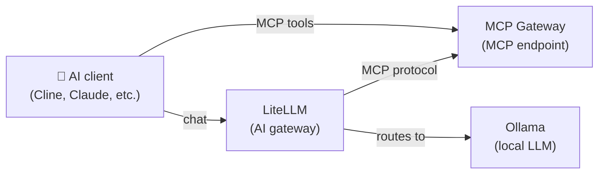

[English](README.md) | [简体中文](README-zh.md) | [繁體中文](README-zh-Hant.md) | [Русский](README-ru.md)

# AI Tools

Local LLM with MCP tool access for AI coding assistants (Cline, Claude, Cursor, etc.).

**Services:** Ollama (LLM) + LiteLLM (gateway) + MCP Gateway

**Memory:** ~3 GB RAM (with a 3B model)

## Architecture



## Services

| Service | Role | Default port |
|---|---|---|
| **[Ollama (LLM)](https://github.com/hwdsl2/docker-ollama)** | Runs local LLM models (llama3, qwen, mistral, etc.) | `11434` |
| **[LiteLLM](https://github.com/hwdsl2/docker-litellm)** | AI gateway — routes requests to Ollama and 100+ providers | `4000` |
| **[MCP Gateway](https://github.com/hwdsl2/docker-mcp-gateway)** | Provides MCP tools (filesystem, fetch, GitHub, search, databases) to AI clients | `3000` |

## Quick start

```bash
git clone https://github.com/hwdsl2/docker-ai-stack
cd docker-ai-stack/stacks/ai-tools
docker compose up -d
```

**Pull a model** (required before making LLM requests):

```bash
docker exec ollama ollama_manage --pull llama3.2:3b
```

## Running without Docker Compose

If you prefer using `docker run` commands directly, first create a shared network so services can communicate:

```bash
docker network create ai-stack
```

Then start each service on the shared network:

```bash
# Ollama (LLM)
docker run -d --name ollama --restart always \
    --network ai-stack \
    -v ollama-data:/var/lib/ollama \
    hwdsl2/ollama-server

# LiteLLM (AI gateway)
docker run -d --name litellm --restart always \
    --network ai-stack \
    -p 4000:4000 \
    -e LITELLM_OLLAMA_BASE_URL=http://ollama:11434 \
    -v litellm-data:/etc/litellm \
    hwdsl2/litellm-server

# MCP Gateway
docker run -d --name mcp --restart always \
    --network ai-stack \
    -p 3000:3000 \
    -v mcp-data:/var/lib/mcp \
    hwdsl2/mcp-gateway
```

**Note:** The shared network allows services to reach each other by container name (e.g., LiteLLM connects to Ollama via `http://ollama:11434`).

**Pull a model** (required before making LLM requests):

```bash
docker exec ollama ollama_manage --pull llama3.2:3b
```

## Customization

Each service can be configured with an optional env file. Copy the example env file from the respective repository, edit it, and uncomment the volume mount in `docker-compose.yml`:

| Service | Env file | Repository |
|---|---|---|
| Ollama | `ollama.env` | [docker-ollama](https://github.com/hwdsl2/docker-ollama) |
| LiteLLM | `litellm.env` | [docker-litellm](https://github.com/hwdsl2/docker-litellm) |
| MCP Gateway | `mcp.env` | [docker-mcp-gateway](https://github.com/hwdsl2/docker-mcp-gateway) |

For detailed configuration options, API reference, and model management, see the documentation in each service's repository.

## Update images

To update all services to the latest versions:

```bash
docker compose pull
docker compose up -d
```

Your data is preserved in the Docker volumes.

## Usage

```bash
# Get API keys
LITELLM_KEY=$(docker exec litellm litellm_manage --getkey)
MCP_KEY=$(docker exec mcp mcp_manage --getkey)

# Connect MCP Gateway to LiteLLM by adding to your LiteLLM config:
# mcp_servers:
#   - url: http://mcp:3000/mcp
#     transport: sse
#     headers:
#       Authorization: "Bearer <mcp_api_key>"

# Use with an AI client (e.g., Cline in VS Code):
# LLM endpoint: http://localhost:4000 (with LITELLM_KEY)
# MCP endpoint: http://localhost:3000/mcp (with MCP_KEY)