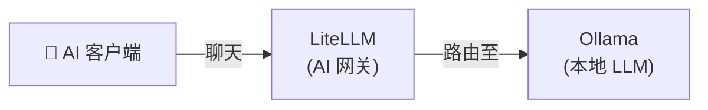

[English](README.md) | [简体中文](README-zh.md) | [繁體中文](README-zh-Hant.md) | [Русский](README-ru.md)

# 纯聊天

最小化本地聊天设置 — 本地 LLM 搭配 OpenAI 兼容 API 网关。

**服务：** Ollama (LLM) + LiteLLM (网关)

**内存：** ~2.5 GB RAM（使用 3B 模型）

## 架构



## 服务

| 服务 | 用途 | 默认端口 |
|---|---|---|
| **[Ollama (LLM)](https://github.com/hwdsl2/docker-ollama/blob/main/README-zh.md)** | 运行本地 LLM 模型（llama3、qwen、mistral 等） | `11434` |
| **[LiteLLM](https://github.com/hwdsl2/docker-litellm/blob/main/README-zh.md)** | 带管理界面的 AI 网关 — 将请求路由至 Ollama 及 100+ 供应商 | `4000` |

## 快速开始

```bash
git clone https://github.com/hwdsl2/docker-ai-stack
cd docker-ai-stack/stacks/chat-only
docker compose up -d
```

**拉取模型**（发出 LLM 请求前必须执行）：

```bash
docker exec ollama ollama_manage --pull llama3.2:3b
```

## GPU 加速 (NVIDIA CUDA)

如需 NVIDIA GPU 加速，请使用 CUDA 编排文件：

```bash
docker compose -f docker-compose.cuda.yml up -d
```

**要求：** NVIDIA GPU、[NVIDIA 驱动](https://www.nvidia.com/en-us/drivers/) 535+，以及在宿主机上安装 [NVIDIA Container Toolkit](https://docs.nvidia.com/datacenter/cloud-native/container-toolkit/latest/install-guide.html)。CUDA 镜像仅支持 `linux/amd64`。

## 不使用 Docker Compose 运行

如需直接使用 `docker run` 命令，请先创建共享网络以便服务之间通信：

```bash
docker network create ai-stack
```

然后在共享网络上启动各服务：

```bash
# Ollama (LLM)
docker run -d --name ollama --restart always \
    --network ai-stack \
    -v ollama-data:/var/lib/ollama \
    hwdsl2/ollama-server

# LiteLLM (AI 网关)
docker run -d --name litellm --restart always \
    --network ai-stack \
    -p 4000:4000 \
    -e LITELLM_OLLAMA_BASE_URL=http://ollama:11434 \
    -v litellm-data:/etc/litellm \
    hwdsl2/litellm-server
```

**注：** 共享网络允许服务通过容器名称互相访问（例如 LiteLLM 通过 `http://ollama:11434` 连接 Ollama）。

**拉取模型**（发出 LLM 请求前必须执行）：

```bash
docker exec ollama ollama_manage --pull llama3.2:3b
```

## 验证部署

启动后，可以验证所有服务是否正常运行：

```bash
# 在 docker-ai-stack 根目录中运行
../../stack-check.sh
```

**访问 LiteLLM 管理界面：**

在浏览器中打开 `http://<server-ip>:4000/ui`。使用用户名 `admin` 和您的 LiteLLM 主密钥作为密码登录。管理界面提供虚拟密钥管理、支出追踪和模型配置功能。

**注：** 对于面向互联网的部署，强烈建议使用[反向代理](#面向互联网的部署)添加 HTTPS。在这种情况下，还需将 `docker-compose.yml` 中的 `"4000:4000/tcp"` 改为 `"127.0.0.1:4000:4000/tcp"`，以防止直接访问未加密端口。

**在 Playground 中试用：**

在管理界面中，点击左侧菜单的 **Playground**。从下拉列表中选择本地模型（例如 `ollama/llama3.2:3b`）并开始对话 — 这是验证本地大语言模型端到端正常工作的一种快速方式。

## 自定义配置

每个服务可以通过可选的 env 文件进行配置。从相应仓库复制示例 env 文件，编辑后取消 `docker-compose.yml` 中的卷挂载注释：

| 服务 | Env 文件 | 仓库 |
|---|---|---|
| Ollama | `ollama.env` | [docker-ollama](https://github.com/hwdsl2/docker-ollama/blob/main/README-zh.md) |
| LiteLLM | `litellm.env` | [docker-litellm](https://github.com/hwdsl2/docker-litellm/blob/main/README-zh.md) |

有关详细配置选项、API 参考和模型管理，请参阅各服务仓库的文档。

## 面向互联网的部署

默认情况下，所有服务通过纯 HTTP 监听。对于面向互联网的部署，请在技术栈前面放置反向代理（例如 [Caddy](https://caddyserver.com/)、Nginx 或 Traefik）以提供 HTTPS。每个服务仓库都包含详细的[反向代理指南](https://github.com/hwdsl2/docker-litellm/blob/main/README-zh.md#使用反向代理)，含 Caddy 和 nginx 示例。

## 更新镜像

将所有服务更新到最新版本：

```bash
docker compose pull
docker compose up -d
```

您的数据保存在 Docker 卷中。

## 示例

```bash
LITELLM_KEY=$(docker exec litellm litellm_manage --getkey)

curl http://localhost:4000/v1/chat/completions \
    -H "Authorization: Bearer $LITELLM_KEY" \
    -H "Content-Type: application/json" \
    -d '{
      "model": "ollama/llama3.2:3b",
      "messages": [{"role": "user", "content": "Hello, how are you?"}]
    }' | jq -r '.choices[0].message.content'