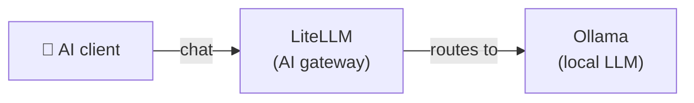

[English](README.md) | [简体中文](README-zh.md) | [繁體中文](README-zh-Hant.md) | [Русский](README-ru.md)

# Chat Only

Minimal local chat setup — a local LLM with an OpenAI-compatible API gateway.

**Services:** Ollama (LLM) + LiteLLM (gateway)

**Memory:** ~2.5 GB RAM (with a 3B model)

## Architecture



## Services

| Service | Role | Default port |
|---|---|---|
| **[Ollama (LLM)](https://github.com/hwdsl2/docker-ollama)** | Runs local LLM models (llama3, qwen, mistral, etc.) | `11434` |
| **[LiteLLM](https://github.com/hwdsl2/docker-litellm)** | AI gateway — routes requests to Ollama and 100+ providers | `4000` |

## Quick start

```bash
git clone https://github.com/hwdsl2/docker-ai-stack
cd docker-ai-stack/stacks/chat-only
docker compose up -d
```

**Pull a model** (required before making LLM requests):

```bash
docker exec ollama ollama_manage --pull llama3.2:3b
```

## GPU acceleration (NVIDIA CUDA)

For NVIDIA GPU acceleration, use the CUDA compose file:

```bash
docker compose -f docker-compose.cuda.yml up -d
```

**Requirements:** NVIDIA GPU, [NVIDIA driver](https://www.nvidia.com/en-us/drivers/) 535+, and the [NVIDIA Container Toolkit](https://docs.nvidia.com/datacenter/cloud-native/container-toolkit/latest/install-guide.html) installed on the host. CUDA images are `linux/amd64` only.

## Running without Docker Compose

If you prefer using `docker run` commands directly, first create a shared network so services can communicate:

```bash
docker network create ai-stack
```

Then start each service on the shared network:

```bash
# Ollama (LLM)
docker run -d --name ollama --restart always \
    --network ai-stack \
    -v ollama-data:/var/lib/ollama \
    hwdsl2/ollama-server

# LiteLLM (AI gateway)
docker run -d --name litellm --restart always \
    --network ai-stack \
    -p 4000:4000 \
    -e LITELLM_OLLAMA_BASE_URL=http://ollama:11434 \
    -v litellm-data:/etc/litellm \
    hwdsl2/litellm-server
```

**Note:** The shared network allows services to reach each other by container name (e.g., LiteLLM connects to Ollama via `http://ollama:11434`).

**Pull a model** (required before making LLM requests):

```bash
docker exec ollama ollama_manage --pull llama3.2:3b
```

## Verify deployment

After starting the stack, you can verify that all services are running correctly:

```bash
# Run from the docker-ai-stack root directory
../../stack-check.sh
```

## Customization

Each service can be configured with an optional env file. Copy the example env file from the respective repository, edit it, and uncomment the volume mount in `docker-compose.yml`:

| Service | Env file | Repository |
|---|---|---|
| Ollama | `ollama.env` | [docker-ollama](https://github.com/hwdsl2/docker-ollama) |
| LiteLLM | `litellm.env` | [docker-litellm](https://github.com/hwdsl2/docker-litellm) |

For detailed configuration options, API reference, and model management, see the documentation in each service's repository.

## Update images

To update all services to the latest versions:

```bash
docker compose pull
docker compose up -d
```

Your data is preserved in the Docker volumes.

## Example

```bash
LITELLM_KEY=$(docker exec litellm litellm_manage --showkey | grep '^sk-' | head -1)

curl http://localhost:4000/v1/chat/completions \
    -H "Authorization: Bearer $LITELLM_KEY" \
    -H "Content-Type: application/json" \
    -d '{
      "model": "ollama/llama3.2:3b",
      "messages": [{"role": "user", "content": "Hello, how are you?"}]
    }' | jq -r '.choices[0].message.content'