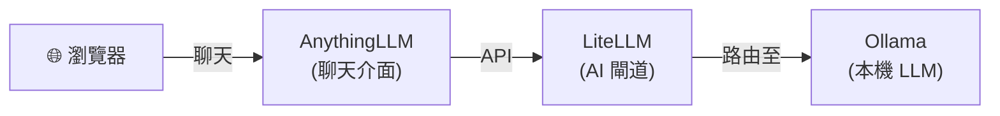

[English](README.md) | [简体中文](README-zh.md) | [繁體中文](README-zh-Hant.md) | [Русский](README-ru.md)

# 聊天介面

本機 ChatGPT 般的體驗 — 基於本機 LLM 和 OpenAI 相容 API 閘道的 Web 聊天介面。

**服務：** Ollama (LLM) + LiteLLM (閘道) + [AnythingLLM](https://github.com/Mintplex-Labs/anything-llm) (聊天介面)

**記憶體：** ~3 GB RAM（使用 3B 模型）

## 架構



## 服務

| 服務 | 用途 | 預設埠 |
|---|---|---|
| **[Ollama (LLM)](https://github.com/hwdsl2/docker-ollama/blob/main/README-zh-Hant.md)** | 執行本機 LLM 模型（llama3、qwen、mistral 等） | `11434` |
| **[LiteLLM](https://github.com/hwdsl2/docker-litellm/blob/main/README-zh-Hant.md)** | 帶管理介面的 AI 閘道 — 將請求路由至 Ollama 及 100+ 供應商 | `4000` |
| **[AnythingLLM](https://github.com/Mintplex-Labs/anything-llm)** | 基於 Web 的聊天介面，支援工作區、RAG 和智慧代理 | `3001` |

## 快速開始

```bash
git clone https://github.com/hwdsl2/docker-ai-stack
cd docker-ai-stack/stacks/chat-ui
docker compose up -d
```

**拉取模型**（發出 LLM 請求前必須執行）：

```bash
docker exec ollama ollama_manage --pull llama3.2:3b
```

**開啟聊天介面：**

AnythingLLM 已預先設定連線到 LiteLLM。API 金鑰透過 Docker 卷自動共享 — 無需手動設定。

在瀏覽器中開啟 `http://<伺服器IP>:3001` — 即可直接開始聊天。LLM 供應商、基礎 URL 和模型已預先設定。

**注：** 對於面向公網的部署，**強烈建議**使用[反向代理](#使用反向代理)新增 HTTPS。在這種情況下，還應將 `docker-compose.yml` 中的 `"3001:3001/tcp"` 改為 `"127.0.0.1:3001:3001/tcp"`，並將 `"4000:4000/tcp"` 改為 `"127.0.0.1:4000:4000/tcp"`，以防止直接存取未加密的連接埠。請[設定密碼](https://docs.useanything.com/features/security-and-access)保護 AnythingLLM，尤其是在伺服器可從公網存取時。

## GPU 加速 (NVIDIA CUDA)

如需 NVIDIA GPU 加速，請使用 CUDA 編排檔案：

```bash
docker compose -f docker-compose.cuda.yml up -d
```

**要求：** NVIDIA GPU、[NVIDIA 驅動程式](https://www.nvidia.com/en-us/drivers/) 535+，以及在主機上安裝 [NVIDIA Container Toolkit](https://docs.nvidia.com/datacenter/cloud-native/container-toolkit/latest/install-guide.html)。CUDA 映像僅支援 `linux/amd64`。

## 不使用 Docker Compose 執行

如需直接使用 `docker run` 命令，請先建立共享網路以便服務之間通訊：

```bash
docker network create ai-stack
```

然後在共享網路上啟動各服務：

```bash
# Ollama (LLM)
docker run -d --name ollama --restart always \
    --network ai-stack \
    -v ollama-data:/var/lib/ollama \
    hwdsl2/ollama-server

# LiteLLM (AI 閘道)
docker run -d --name litellm --restart always \
    --network ai-stack \
    -p 4000:4000 \
    -e LITELLM_OLLAMA_BASE_URL=http://ollama:11434 \
    -v litellm-data:/etc/litellm \
    hwdsl2/litellm-server

# AnythingLLM (聊天介面)
docker run -d --name anythingllm --restart always \
    --network ai-stack \
    -p 3001:3001 \
    -e STORAGE_DIR=/app/server/storage \
    -e LLM_PROVIDER=generic-openai \
    -e GENERIC_OPEN_AI_BASE_PATH=http://litellm:4000/v1 \
    -e GENERIC_OPEN_AI_MODEL_PREF=ollama/llama3.2:3b \
    -e GENERIC_OPEN_AI_MODEL_TOKEN_LIMIT=131072 \
    -e EMBEDDING_ENGINE=native \
    -v anythingllm-data:/app/server/storage \
    mintplexlabs/anythingllm
```

**注：** 共享網路允許服務透過容器名稱互相存取（例如 AnythingLLM 透過 `http://litellm:4000` 連線 LiteLLM）。

**拉取模型**（發出 LLM 請求前必須執行）：

```bash
docker exec ollama ollama_manage --pull llama3.2:3b
```

## 驗證部署

啟動後，可以驗證所有服務是否正常執行：

```bash
# 在 docker-ai-stack 根目錄中執行
../../stack-check.sh
```

**存取 LiteLLM 管理介面：**

在瀏覽器中開啟 `http://<server-ip>:4000/ui`。使用使用者名稱 `admin` 和您的 LiteLLM 主密鑰作為密碼登入。管理介面提供虛擬金鑰管理、支出追蹤和模型設定功能。

**在 Playground 中試用：**

在管理介面中，點選左側選單的 **Playground**。從下拉清單中選擇本機模型（例如 `ollama/llama3.2:3b`）並開始對話 — 這是驗證本機大型語言模型端到端正常運作的最快方式。

## 自訂設定

每個服務可以透過可選的 env 檔案進行設定。從相應儲存庫複製範例 env 檔案，編輯後取消 `docker-compose.yml` 中的掛載註解：

| 服務 | Env 檔案 | 儲存庫 |
|---|---|---|
| Ollama | `ollama.env` | [docker-ollama](https://github.com/hwdsl2/docker-ollama/blob/main/README-zh-Hant.md) |
| LiteLLM | `litellm.env` | [docker-litellm](https://github.com/hwdsl2/docker-litellm/blob/main/README-zh-Hant.md) |

AnythingLLM 透過其 Web 介面 `http://<伺服器IP>:3001` 進行設定。您可以在 **Settings** 中變更 LLM 供應商、模型、嵌入引擎和其他設定。

**提示：** 如果您同時執行其他子棧（例如 [voice-pipeline](../voice-pipeline/README-zh-Hant.md)、[rag-pipeline](../rag-pipeline/README-zh-Hant.md)），可以透過 AnythingLLM 的設定頁面將其指向這些服務 — 例如使用 `docker-whisper` 進行語音轉文字，或使用 `docker-embeddings` 進行向量嵌入。

有關詳細設定選項、API 參考和模型管理，請參閱各服務儲存庫的文件。

## 使用反向代理

如需面向公網部署，可在 AnythingLLM 前置反向代理處理 HTTPS 終止。在本地或可信網路中使用無需 HTTPS，但將聊天介面暴露在公網時建議啟用 HTTPS。

從反向代理存取 AnythingLLM 容器時使用以下位址之一：

- **`anythingllm:3001`** — 如果反向代理作為容器執行在與 AnythingLLM **同一 Docker 網路**中（例如定義在同一 `docker-compose.yml` 中）。
- **`127.0.0.1:3001`** — 如果反向代理執行在**主機上**且連接埠 `3001` 已發布（預設 `docker-compose.yml` 會發布該連接埠）。

**使用 [Caddy](https://caddyserver.com/docs/)（[Docker 映像檔](https://hub.docker.com/_/caddy)）的範例**（自動 Let's Encrypt TLS，反向代理在同一 Docker 網路中）：

`Caddyfile`：
```
chat.example.com {
  reverse_proxy anythingllm:3001
}
```

**使用 nginx 的範例**（反向代理執行在主機上）：

```nginx
server {
    listen 443 ssl;
    server_name chat.example.com;

    ssl_certificate     /path/to/cert.pem;
    ssl_certificate_key /path/to/key.pem;

    location / {
        proxy_pass         http://127.0.0.1:3001;
        proxy_set_header   Host $host;
        proxy_set_header   X-Real-IP $remote_addr;
        proxy_set_header   X-Forwarded-For $proxy_add_x_forwarded_for;
        proxy_set_header   X-Forwarded-Proto $scheme;
        proxy_http_version 1.1;
        proxy_read_timeout 300s;
    }
}
```

**重要提示：** AnythingLLM 包含內建的使用者驗證系統——將服務暴露到網際網路時，請在首次設定時設定強密碼。

## 更新映像

將所有服務更新到最新版本：

```bash
docker compose pull
docker compose up -d
```

您的資料保存在 Docker 卷中。

## 範例

```bash
# 在瀏覽器中開啟聊天介面
open http://localhost:3001
```

或直接使用 LiteLLM API：

```bash
LITELLM_KEY=$(docker exec litellm litellm_manage --getkey)

curl http://localhost:4000/v1/chat/completions \
    -H "Authorization: Bearer $LITELLM_KEY" \
    -H "Content-Type: application/json" \
    -d '{
      "model": "ollama/llama3.2:3b",
      "messages": [{"role": "user", "content": "Hello, how are you?"}]
    }' | jq -r '.choices[0].message.content'