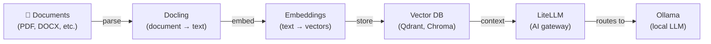

[English](README.md) | [简体中文](README-zh.md) | [繁體中文](README-zh-Hant.md) | [Русский](README-ru.md)

# RAG Pipeline (Full)

Parse documents, embed them for semantic search, and answer questions with a local LLM.

**Services:** Ollama (LLM) + LiteLLM (gateway) + Embeddings + Docling (document parsing)

**Memory:** ~4 GB RAM (with a 3B model)

## Architecture



## Services

| Service | Role | Default port |
|---|---|---|
| **[Ollama (LLM)](https://github.com/hwdsl2/docker-ollama)** | Runs local LLM models (llama3, qwen, mistral, etc.) | `11434` |
| **[LiteLLM](https://github.com/hwdsl2/docker-litellm)** | AI gateway — routes requests to Ollama and 100+ providers | `4000` |
| **[Embeddings](https://github.com/hwdsl2/docker-embeddings)** | Converts text to vectors for semantic search and RAG | `8000` |
| **[Docling](https://github.com/hwdsl2/docker-docling)** | Converts documents (PDF, DOCX, etc.) to structured text/Markdown | `5001` |

## Quick start

```bash
git clone https://github.com/hwdsl2/docker-ai-stack
cd docker-ai-stack/stacks/rag-pipeline-full
docker compose up -d
```

**Pull a model** (required before making LLM requests):

```bash
docker exec ollama ollama_manage --pull llama3.2:3b
```

## GPU acceleration (NVIDIA CUDA)

For NVIDIA GPU acceleration, use the CUDA compose file:

```bash
docker compose -f docker-compose.cuda.yml up -d
```

**Requirements:** NVIDIA GPU, [NVIDIA driver](https://www.nvidia.com/en-us/drivers/) 535+, and the [NVIDIA Container Toolkit](https://docs.nvidia.com/datacenter/cloud-native/container-toolkit/latest/install-guide.html) installed on the host. CUDA images are `linux/amd64` only.

## Running without Docker Compose

If you prefer using `docker run` commands directly, first create a shared network so services can communicate:

```bash
docker network create ai-stack
```

Then start each service on the shared network:

```bash
# Ollama (LLM)
docker run -d --name ollama --restart always \
    --network ai-stack \
    -v ollama-data:/var/lib/ollama \
    hwdsl2/ollama-server

# LiteLLM (AI gateway)
docker run -d --name litellm --restart always \
    --network ai-stack \
    -p 4000:4000 \
    -e LITELLM_OLLAMA_BASE_URL=http://ollama:11434 \
    -v litellm-data:/etc/litellm \
    hwdsl2/litellm-server

# Embeddings
docker run -d --name embeddings --restart always \
    --network ai-stack \
    -p 8000:8000 \
    -v embeddings-data:/var/lib/embeddings \
    hwdsl2/embeddings-server

# Docling (document parsing)
docker run -d --name docling --restart always \
    --network ai-stack \
    -p 5001:5001 \
    -v docling-data:/var/lib/docling \
    hwdsl2/docling-server
```

**Note:** The shared network allows services to reach each other by container name (e.g., LiteLLM connects to Ollama via `http://ollama:11434`).

**Pull a model** (required before making LLM requests):

```bash
docker exec ollama ollama_manage --pull llama3.2:3b
```

## Verify deployment

After starting the stack, you can verify that all services are running correctly:

```bash
# Run from the docker-ai-stack root directory
../../stack-check.sh
```

## Customization

Each service can be configured with an optional env file. Copy the example env file from the respective repository, edit it, and uncomment the volume mount in `docker-compose.yml`:

| Service | Env file | Repository |
|---|---|---|
| Ollama | `ollama.env` | [docker-ollama](https://github.com/hwdsl2/docker-ollama) |
| LiteLLM | `litellm.env` | [docker-litellm](https://github.com/hwdsl2/docker-litellm) |
| Embeddings | `embed.env` | [docker-embeddings](https://github.com/hwdsl2/docker-embeddings) |
| Docling | `docling.env` | [docker-docling](https://github.com/hwdsl2/docker-docling) |

For detailed configuration options, API reference, and model management, see the documentation in each service's repository.

## Update images

To update all services to the latest versions:

```bash
docker compose pull
docker compose up -d
```

Your data is preserved in the Docker volumes.

## Example

```bash
LITELLM_KEY=$(docker exec litellm litellm_manage --showkey | grep '^sk-' | head -1)

# Step 1: Convert a PDF to Markdown using Docling
curl -s -X POST http://localhost:5001/v1/convert/file \
    -F "file=@document.pdf" \
    | jq -r '.document.md_content' > extracted.md

# Step 2: Embed the extracted text
curl -s http://localhost:8000/v1/embeddings \
    -H "Content-Type: application/json" \
    -d '{"input": "Docker simplifies deployment by packaging apps in containers.", "model": "text-embedding-ada-002"}' \
    | jq '.data[0].embedding'
# → Store the vector in your vector DB (Qdrant, Chroma, pgvector, etc.)

# Step 3: Query: embed the question, retrieve context from vector DB, then ask the LLM
curl -s http://localhost:4000/v1/chat/completions \
    -H "Authorization: Bearer $LITELLM_KEY" \
    -H "Content-Type: application/json" \
    -d '{
      "model": "ollama/llama3.2:3b",
      "messages": [
        {"role": "system", "content": "Answer using only the provided context."},
        {"role": "user", "content": "What does Docker do?\n\nContext: Docker simplifies deployment by packaging apps in containers."}
      ]
    }' \
    | jq -r '.choices[0].message.content'