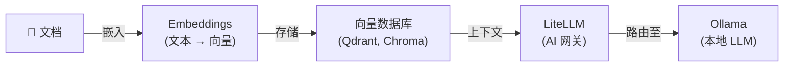

[English](README.md) | [简体中文](README-zh.md) | [繁體中文](README-zh-Hant.md) | [Русский](README-ru.md)

# RAG 管道

嵌入文档用于语义搜索，并使用本地 LLM 回答问题。

**服务：** Ollama (LLM) + LiteLLM (网关) + Embeddings

**内存：** ~3 GB RAM（使用 3B 模型）

## 架构



## 服务

| 服务 | 用途 | 默认端口 |
|---|---|---|
| **[Ollama (LLM)](https://github.com/hwdsl2/docker-ollama/blob/main/README-zh.md)** | 运行本地 LLM 模型（llama3、qwen、mistral 等） | `11434` |
| **[LiteLLM](https://github.com/hwdsl2/docker-litellm/blob/main/README-zh.md)** | 带管理界面的 AI 网关 — 将请求路由至 Ollama 及 100+ 供应商 | `4000` |
| **[Embeddings](https://github.com/hwdsl2/docker-embeddings/blob/main/README-zh.md)** | 将文本转换为向量，用于语义搜索和 RAG | `8000` |

## 快速开始

```bash
git clone https://github.com/hwdsl2/docker-ai-stack
cd docker-ai-stack/stacks/rag-pipeline
docker compose up -d
```

**拉取模型**（发出 LLM 请求前必须执行）：

```bash
docker exec ollama ollama_manage --pull llama3.2:3b
```

## GPU 加速 (NVIDIA CUDA)

如需 NVIDIA GPU 加速，请使用 CUDA 编排文件：

```bash
docker compose -f docker-compose.cuda.yml up -d
```

**要求：** NVIDIA GPU、[NVIDIA 驱动](https://www.nvidia.com/en-us/drivers/) 535+，以及在宿主机上安装 [NVIDIA Container Toolkit](https://docs.nvidia.com/datacenter/cloud-native/container-toolkit/latest/install-guide.html)。CUDA 镜像仅支持 `linux/amd64`。

## 不使用 Docker Compose 运行

如需直接使用 `docker run` 命令，请先创建共享网络以便服务之间通信：

```bash
docker network create ai-stack
```

然后在共享网络上启动各服务：

```bash
# Ollama (LLM)
docker run -d --name ollama --restart always \
    --network ai-stack \
    -v ollama-data:/var/lib/ollama \
    hwdsl2/ollama-server

# LiteLLM (AI 网关)
docker run -d --name litellm --restart always \
    --network ai-stack \
    -p 4000:4000 \
    -e LITELLM_OLLAMA_BASE_URL=http://ollama:11434 \
    -v litellm-data:/etc/litellm \
    hwdsl2/litellm-server

# Embeddings
docker run -d --name embeddings --restart always \
    --network ai-stack \
    -p 127.0.0.1:8000:8000 \
    -v embeddings-data:/var/lib/embeddings \
    hwdsl2/embeddings-server
```

**注：** 共享网络允许服务通过容器名称互相访问（例如 LiteLLM 通过 `http://ollama:11434` 连接 Ollama）。

**拉取模型**（发出 LLM 请求前必须执行）：

```bash
docker exec ollama ollama_manage --pull llama3.2:3b
```

## 验证部署

启动后，可以验证所有服务是否正常运行：

```bash
# 在 docker-ai-stack 根目录中运行
../../stack-check.sh
```

**访问 LiteLLM 管理界面：**

在浏览器中打开 `http://<server-ip>:4000/ui`。使用用户名 `admin` 和您的 LiteLLM 主密钥作为密码登录。管理界面提供虚拟密钥管理、支出追踪和模型配置功能。

## 自定义配置

每个服务可以通过可选的 env 文件进行配置。从相应仓库复制示例 env 文件，编辑后取消 `docker-compose.yml` 中的卷挂载注释：

| 服务 | Env 文件 | 仓库 |
|---|---|---|
| Ollama | `ollama.env` | [docker-ollama](https://github.com/hwdsl2/docker-ollama/blob/main/README-zh.md) |
| LiteLLM | `litellm.env` | [docker-litellm](https://github.com/hwdsl2/docker-litellm/blob/main/README-zh.md) |
| Embeddings | `embed.env` | [docker-embeddings](https://github.com/hwdsl2/docker-embeddings/blob/main/README-zh.md) |

有关详细配置选项、API 参考和模型管理，请参阅各服务仓库的文档。

## 更新镜像

将所有服务更新到最新版本：

```bash
docker compose pull
docker compose up -d
```

您的数据保存在 Docker 卷中。

## 示例

```bash
LITELLM_KEY=$(docker exec litellm litellm_manage --getkey)

# 嵌入文档片段
curl -s http://localhost:8000/v1/embeddings \
    -H "Content-Type: application/json" \
    -d '{"input": "Docker simplifies deployment by packaging apps in containers.", "model": "text-embedding-ada-002"}' \
    | jq '.data[0].embedding'
# → 将向量存储到向量数据库（Qdrant、Chroma、pgvector 等）

# 查询：嵌入问题，从向量数据库检索上下文，然后向 LLM 提问
curl -s http://localhost:4000/v1/chat/completions \
    -H "Authorization: Bearer $LITELLM_KEY" \
    -H "Content-Type: application/json" \
    -d '{
      "model": "ollama/llama3.2:3b",
      "messages": [
        {"role": "system", "content": "Answer using only the provided context."},
        {"role": "user", "content": "What does Docker do?\n\nContext: Docker simplifies deployment by packaging apps in containers."}
      ]
    }' \
    | jq -r '.choices[0].message.content'