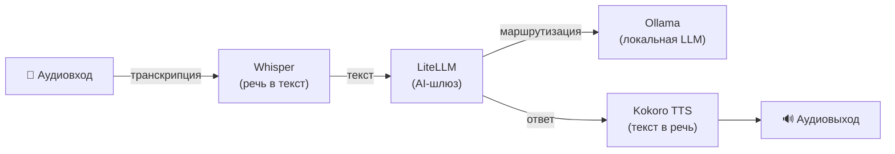

[English](README.md) | [简体中文](README-zh.md) | [繁體中文](README-zh-Hant.md) | [Русский](README-ru.md)

# Голосовой конвейер

Речь в текст → LLM → текст в речь. Транскрибируйте аудио, получите ответ AI и прослушайте его.

**Сервисы:** Whisper (STT) + Ollama (LLM) + LiteLLM (шлюз) + Kokoro (TTS)

**Память:** ~5 ГБ RAM (с моделью 3B)

## Архитектура



## Сервисы

| Сервис | Назначение | Порт по умолчанию |
|---|---|---|
| **[Whisper (STT)](https://github.com/hwdsl2/docker-whisper)** | Транскрибирует речь в текст | `9000` |
| **[Ollama (LLM)](https://github.com/hwdsl2/docker-ollama)** | Запускает локальные LLM-модели (llama3, qwen, mistral и др.) | `11434` |
| **[LiteLLM](https://github.com/hwdsl2/docker-litellm)** | AI-шлюз — маршрутизирует запросы к Ollama и 100+ провайдерам | `4000` |
| **[Kokoro (TTS)](https://github.com/hwdsl2/docker-kokoro)** | Преобразует текст в естественную речь | `8880` |

## Быстрый старт

```bash
git clone https://github.com/hwdsl2/docker-ai-stack
cd docker-ai-stack/stacks/voice-pipeline
docker compose up -d
```

**Загрузка модели** (обязательно перед отправкой LLM-запросов):

```bash
docker exec ollama ollama_manage --pull llama3.2:3b
```

## GPU-ускорение (NVIDIA CUDA)

Для GPU-ускорения NVIDIA используйте CUDA compose-файл:

```bash
docker compose -f docker-compose.cuda.yml up -d
```

**Требования:** GPU NVIDIA, [драйвер NVIDIA](https://www.nvidia.com/en-us/drivers/) 535+, и [NVIDIA Container Toolkit](https://docs.nvidia.com/datacenter/cloud-native/container-toolkit/latest/install-guide.html), установленный на хосте. CUDA-образы поддерживают только `linux/amd64`.

## Запуск без Docker Compose

Если вы предпочитаете использовать команды `docker run` напрямую, сначала создайте общую сеть для связи между сервисами:

```bash
docker network create ai-stack
```

Затем запустите каждый сервис в общей сети:

```bash
# Ollama (LLM)
docker run -d --name ollama --restart always \
    --network ai-stack \
    -v ollama-data:/var/lib/ollama \
    hwdsl2/ollama-server

# LiteLLM (AI-шлюз)
docker run -d --name litellm --restart always \
    --network ai-stack \
    -p 4000:4000 \
    -e LITELLM_OLLAMA_BASE_URL=http://ollama:11434 \
    -v litellm-data:/etc/litellm \
    hwdsl2/litellm-server

# Whisper (STT)
docker run -d --name whisper --restart always \
    --network ai-stack \
    -p 9000:9000 \
    -v whisper-data:/var/lib/whisper \
    hwdsl2/whisper-server

# Kokoro (TTS)
docker run -d --name kokoro --restart always \
    --network ai-stack \
    -p 8880:8880 \
    -v kokoro-data:/var/lib/kokoro \
    hwdsl2/kokoro-server
```

**Примечание:** Общая сеть позволяет сервисам обращаться друг к другу по имени контейнера (например, LiteLLM подключается к Ollama через `http://ollama:11434`).

**Загрузка модели** (обязательно перед отправкой LLM-запросов):

```bash
docker exec ollama ollama_manage --pull llama3.2:3b
```

## Настройка

Каждый сервис можно настроить с помощью опционального env-файла. Скопируйте пример env-файла из соответствующего репозитория, отредактируйте его и раскомментируйте монтирование тома в `docker-compose.yml`:

| Сервис | Env-файл | Репозиторий |
|---|---|---|
| Ollama | `ollama.env` | [docker-ollama](https://github.com/hwdsl2/docker-ollama) |
| LiteLLM | `litellm.env` | [docker-litellm](https://github.com/hwdsl2/docker-litellm) |
| Whisper | `whisper.env` | [docker-whisper](https://github.com/hwdsl2/docker-whisper) |
| Kokoro | `kokoro.env` | [docker-kokoro](https://github.com/hwdsl2/docker-kokoro) |

Подробные параметры настройки, справочник API и управление моделями описаны в документации каждого сервиса.

## Обновление образов

Обновление всех сервисов до последних версий:

```bash
docker compose pull
docker compose up -d
```

Ваши данные сохраняются в Docker-томах.

## Пример

**Совет:** Нужен образец аудиофайла? Скачайте этот образец английской речи (WAV, лицензия MIT) из репозитория [Azure Samples](https://github.com/Azure-Samples/cognitive-services-speech-sdk):

```bash
curl -L -o sample_speech.wav \
    "https://github.com/Azure-Samples/cognitive-services-speech-sdk/raw/master/sampledata/audiofiles/katiesteve.wav"
```

```bash
LITELLM_KEY=$(docker exec litellm litellm_manage --showkey | grep '^sk-' | head -1)

# Транскрибация аудио в текст
TEXT=$(curl -s http://localhost:9000/v1/audio/transcriptions \
    -F file=@sample_speech.wav -F model=whisper-1 | jq -r .text)

# Получение ответа LLM
RESPONSE=$(curl -s http://localhost:4000/v1/chat/completions \
    -H "Authorization: Bearer $LITELLM_KEY" \
    -H "Content-Type: application/json" \
    -d "{\"model\":\"ollama/llama3.2:3b\",\"messages\":[{\"role\":\"user\",\"content\":\"$TEXT\"}]}" \
    | jq -r '.choices[0].message.content')

# Преобразование ответа в речь
curl -s http://localhost:8880/v1/audio/speech \
    -H "Content-Type: application/json" \
    -d "{\"model\":\"tts-1\",\"input\":\"$RESPONSE\",\"voice\":\"af_heart\"}" \
    --output response.mp3