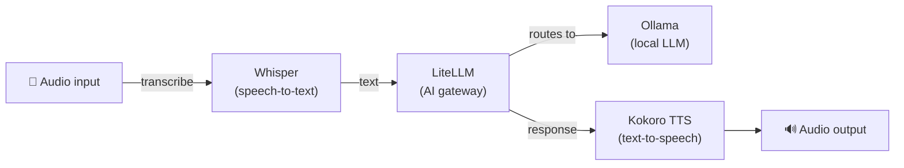

[English](README.md) | [简体中文](README-zh.md) | [繁體中文](README-zh-Hant.md) | [Русский](README-ru.md)

# Voice Pipeline

Speech-to-text → LLM → text-to-speech. Transcribe audio, get an AI response, and hear it spoken back.

**Services:** Whisper (STT) + Ollama (LLM) + LiteLLM (gateway) + Kokoro (TTS)

**Memory:** ~5 GB RAM (with a 3B model)

## Architecture



## Services

| Service | Role | Default port |
|---|---|---|
| **[Whisper (STT)](https://github.com/hwdsl2/docker-whisper)** | Transcribes spoken audio to text | `9000` |
| **[Ollama (LLM)](https://github.com/hwdsl2/docker-ollama)** | Runs local LLM models (llama3, qwen, mistral, etc.) | `11434` |
| **[LiteLLM](https://github.com/hwdsl2/docker-litellm)** | AI gateway — routes requests to Ollama and 100+ providers | `4000` |
| **[Kokoro (TTS)](https://github.com/hwdsl2/docker-kokoro)** | Converts text to natural-sounding speech | `8880` |

## Quick start

```bash
git clone https://github.com/hwdsl2/docker-ai-stack
cd docker-ai-stack/stacks/voice-pipeline
docker compose up -d
```

**Pull a model** (required before making LLM requests):

```bash
docker exec ollama ollama_manage --pull llama3.2:3b
```

## Running without Docker Compose

If you prefer using `docker run` commands directly, first create a shared network so services can communicate:

```bash
docker network create ai-stack
```

Then start each service on the shared network:

```bash
# Ollama (LLM)
docker run -d --name ollama --restart always \
    --network ai-stack \
    -v ollama-data:/var/lib/ollama \
    hwdsl2/ollama-server

# LiteLLM (AI gateway)
docker run -d --name litellm --restart always \
    --network ai-stack \
    -p 4000:4000 \
    -e LITELLM_OLLAMA_BASE_URL=http://ollama:11434 \
    -v litellm-data:/etc/litellm \
    hwdsl2/litellm-server

# Whisper (STT)
docker run -d --name whisper --restart always \
    --network ai-stack \
    -p 9000:9000 \
    -v whisper-data:/var/lib/whisper \
    hwdsl2/whisper-server

# Kokoro (TTS)
docker run -d --name kokoro --restart always \
    --network ai-stack \
    -p 8880:8880 \
    -v kokoro-data:/var/lib/kokoro \
    hwdsl2/kokoro-server
```

**Note:** The shared network allows services to reach each other by container name (e.g., LiteLLM connects to Ollama via `http://ollama:11434`).

**Pull a model** (required before making LLM requests):

```bash
docker exec ollama ollama_manage --pull llama3.2:3b
```

## Customization

Each service can be configured with an optional env file. Copy the example env file from the respective repository, edit it, and uncomment the volume mount in `docker-compose.yml`:

| Service | Env file | Repository |
|---|---|---|
| Ollama | `ollama.env` | [docker-ollama](https://github.com/hwdsl2/docker-ollama) |
| LiteLLM | `litellm.env` | [docker-litellm](https://github.com/hwdsl2/docker-litellm) |
| Whisper | `whisper.env` | [docker-whisper](https://github.com/hwdsl2/docker-whisper) |
| Kokoro | `kokoro.env` | [docker-kokoro](https://github.com/hwdsl2/docker-kokoro) |

For detailed configuration options, API reference, and model management, see the documentation in each service's repository.

## Update images

To update all services to the latest versions:

```bash
docker compose pull
docker compose up -d
```

Your data is preserved in the Docker volumes.

## Example

```bash
LITELLM_KEY=$(docker exec litellm litellm_manage --getkey)

# Transcribe audio to text
TEXT=$(curl -s http://localhost:9000/v1/audio/transcriptions \
    -F file=@question.mp3 -F model=whisper-1 | jq -r .text)

# Get LLM response
RESPONSE=$(curl -s http://localhost:4000/v1/chat/completions \
    -H "Authorization: Bearer $LITELLM_KEY" \
    -H "Content-Type: application/json" \
    -d "{\"model\":\"ollama/llama3.2:3b\",\"messages\":[{\"role\":\"user\",\"content\":\"$TEXT\"}]}" \
    | jq -r '.choices[0].message.content')

# Convert response to speech
curl -s http://localhost:8880/v1/audio/speech \
    -H "Content-Type: application/json" \
    -d "{\"model\":\"tts-1\",\"input\":\"$RESPONSE\",\"voice\":\"af_heart\"}" \
    --output response.mp3